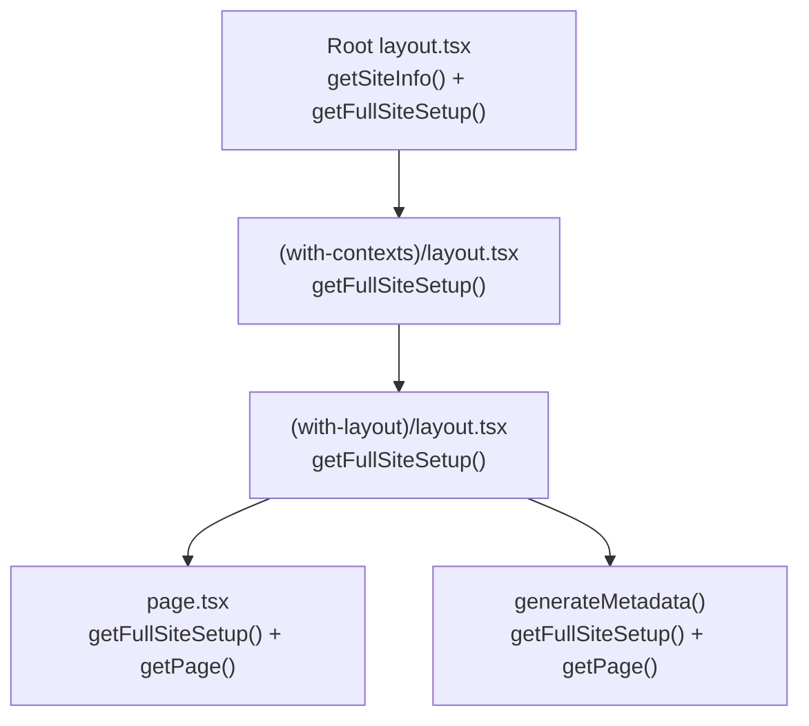

# Public Pages Performance Optimization Report

## Executive Summary

After auditing the `apps/web` codebase, I found that the public page rendering pipeline has **severe data-fetching redundancy** as the dominant bottleneck. A single public page load triggers **8–12 HTTP round-trips** to the same GraphQL API, most of which fetch identical data. This is the single highest-impact area. Below are optimizations ranked by **decreasing ROI**.

---

## 🔴 1. Eliminate Redundant Data Fetching with `React.cache()` (Highest ROI)

**Impact: ~60–70% reduction in server-side render time**
**Effort: Small (1-2 hours)**

### The Problem

Every public page triggers the following call chain, where each level independently fetches the same data:



`getFullSiteSetup()` itself makes **2 sequential HTTP requests** (first [getSiteInfo](file:///Users/rajat/dev/projects/courselit/apps/web/ui-lib/utils.ts#L129-L170), then [getTheme + getPage + getFeatures](file:///Users/rajat/dev/projects/courselit/apps/web/ui-lib/utils.ts#L184-L217)). This means:

| Layer                                                                                                                                      | Calls to `getFullSiteSetup` | HTTP Requests |
| ------------------------------------------------------------------------------------------------------------------------------------------ | :-------------------------: | :-----------: |
| [Root layout.tsx](file:///Users/rajat/dev/projects/courselit/apps/web/app/layout.tsx#L52)                                                  |              1              |       2       |
| [Root generateMetadata](file:///Users/rajat/dev/projects/courselit/apps/web/app/layout.tsx#L16)                                            |       1 (getSiteInfo)       |       1       |
| [(with-contexts)/layout.tsx](<file:///Users/rajat/dev/projects/courselit/apps/web/app/(with-contexts)/layout.tsx#L22>)                     |              1              |       2       |
| [(with-layout)/layout.tsx](<file:///Users/rajat/dev/projects/courselit/apps/web/app/(with-contexts)/(with-layout)/layout.tsx#L12>)         |              1              |       2       |
| [p/[id]/page.tsx](<file:///Users/rajat/dev/projects/courselit/apps/web/app/(with-contexts)/(with-layout)/p/[id]/page.tsx#L80-L83>)         |              1              |       2       |
| [p/[id]/generateMetadata](<file:///Users/rajat/dev/projects/courselit/apps/web/app/(with-contexts)/(with-layout)/p/[id]/page.tsx#L21-L24>) |              1              |       2       |
| **Total per page**                                                                                                                         |            **6**            |    **~11**    |

### The Fix

Wrap the data-fetching functions in `React.cache()`. React automatically deduplicates calls to cached functions **within a single server render request**.

```typescript
// ui-lib/utils.ts
import { cache } from "react";

export const getFullSiteSetup = cache(async (backend: string, id?: string) => {
    // ... existing implementation
});

export const getPage = cache(async (backend: string, id?: string) => {
    // ... existing implementation
});

export const getSiteInfo = cache(async (backend: string) => {
    // ... existing implementation
});
```

This **single change** reduces ~11 HTTP requests per page down to **~3** (one for `getSiteInfo`, one for the batched GraphQL query, and one for `getPage` if applicable). Zero architectural change needed — just wrap existing functions.

---

## 🔴 2. Cache `verify-domain` Domain Lookup (High ROI)

**Impact: ~50–150ms saved per request**
**Effort: Small**

### The Problem

The [proxy function in proxy.ts](file:///Users/rajat/dev/projects/courselit/apps/web/proxy.ts#L5-L89) runs on **every single request** and fetches `/verify-domain`. While the subscription check is already smart (it only calls the external service once per 24 hours via `checkSubscriptionStatusAfter`), the [verify-domain route](file:///Users/rajat/dev/projects/courselit/apps/web/app/verify-domain/route.ts#L40-L198) still does this on **every request**:

1. `await connectToDatabase()` — connection setup overhead
2. `await getDomain(host)` — MongoDB query (`DomainModel.findOne`)

Domain data (name, domainId, logo, title) changes extremely rarely — only when an admin updates site settings.

### The Fix

Cache the `getDomain()` result with a short in-memory TTL:

```typescript
// lib/domain-cache.ts
const domainCache = new Map<string, { data: any; expiresAt: number }>();
const TTL = 60_000; // 60 seconds

export async function getCachedDomain(host: string) {
    const cached = domainCache.get(host);
    if (cached && cached.expiresAt > Date.now()) {
        return cached.data;
    }

    const domain = await getDomain(host);
    domainCache.set(host, { data: domain, expiresAt: Date.now() + TTL });
    return domain;
}
```

For multi-server environments, use **Redis** to cache the domain lookup result keyed by hostname with a 60s TTL.

---

## 🟡 3. Direct Database Queries Instead of HTTP Self-Fetch (High ROI)

**Impact: ~50–100ms saved per internal API call**
**Effort: Medium**

### The Problem

Server Components fetch data by making **HTTP requests to themselves** via the GraphQL API:

```typescript
// ui-lib/utils.ts - Server component making an HTTP request to itself
const fetch = new FetchBuilder()
    .setUrl(`${backend}/api/graph`) // self-referencing HTTP call!
    .setPayload({ query })
    .build();
```

Each call to `/api/graph` goes through:

1. Network round-trip (even if localhost, ~5-15ms)
2. Next.js request handling + middleware re-execution
3. [GraphQL route handler](file:///Users/rajat/dev/projects/courselit/apps/web/app/api/graph/route.ts#L22-L84) does another `DomainModel.findOne()` + `auth.api.getSession()` + `User.findOne()`
4. Then the actual resolver logic runs

### The Fix

**For public pages** (no auth needed), call the database models directly from Server Components:

```typescript
// lib/public-queries.ts
import PageModel from "@models/Page";
import DomainModel from "@models/Domain";
import { cache } from "react";

export const getPublicPage = cache(async (domainId: string, pageId: string) => {
    return PageModel.findOne(
        { pageId, domain: domainId },
        {
            layout: 1,
            title: 1,
            description: 1,
            socialImage: 1,
            robotsAllowed: 1,
        },
    ).lean();
});

export const getPublicSiteSetup = cache(async (domainId: string) => {
    const [domain, theme] = await Promise.all([
        DomainModel.findById(domainId, {
            /* projections */
        }).lean(),
        ThemeModel.findOne({ domain: domainId, active: true }).lean(),
    ]);
    return { settings: domain?.settings, theme, features: domain?.features };
});
```

This eliminates the HTTP round-trip overhead and the redundant auth/domain resolution in the GraphQL handler.

---

## 🟡 4. Redis Caching Layer for Tenant Data (High ROI for Multi-Tenant)

**Impact: ~80–95% reduction in MongoDB load for public pages**
**Effort: Medium**

### The Problem

In a multi-tenant system, site settings, themes, and page layouts rarely change (only when an admin publishes). But every visitor request hits MongoDB.

### The Fix

Add a Redis cache for tenant-scoped, infrequently changing data:

```typescript
// lib/cache.ts
import { createClient } from "redis";

const redis = createClient({ url: process.env.REDIS_URL });
const DEFAULT_TTL = 300; // 5 minutes

export async function getCached<T>(
    key: string,
    fetcher: () => Promise<T>,
    ttl = DEFAULT_TTL,
): Promise<T> {
    const cached = await redis.get(key);
    if (cached) return JSON.parse(cached);

    const data = await fetcher();
    await redis.set(key, JSON.stringify(data), { EX: ttl });
    return data;
}
```

**Cache key structure** (tenant-scoped):

```
site:{domainId}:settings     → SiteInfo (TTL: 5 min)
site:{domainId}:theme        → Theme    (TTL: 5 min)
site:{domainId}:page:{pageId} → Page    (TTL: 5 min)
site:{domainId}:features     → string[] (TTL: 5 min)
```

**Cache invalidation**: Bust the cache in the `updateSiteInfo`, `publish` (page), and `publishTheme` mutation resolvers:

```typescript
// In graphql/pages/logic.ts publish()
await redis.del(`site:${ctx.subdomain._id}:page:${pageId}`);

// In graphql/settings/logic.ts updateSiteInfo()
await redis.del(`site:${ctx.subdomain._id}:settings`);
```

---

## 🟡 5. Convert Client Components to Server Components (Medium ROI)

**Impact: Significantly smaller JS bundles sent to browser**
**Effort: Medium-High**

### The Problem

Several public-facing pages that could be Server Components are marked `"use client"`:

| File                                                                                                                                        | Issue                                                           |
| ------------------------------------------------------------------------------------------------------------------------------------------- | --------------------------------------------------------------- |
| [client-side-page.tsx](<file:///Users/rajat/dev/projects/courselit/apps/web/app/(with-contexts)/(with-layout)/p/[id]/client-side-page.tsx>) | Renders entire page layout client-side. Only uses `useContext`. |
| [home-page-layout.tsx](<file:///Users/rajat/dev/projects/courselit/apps/web/app/(with-contexts)/(with-layout)/home-page-layout.tsx>)        | Same pattern — wraps the entire homepage in `useContext` calls. |
| [blog/page.tsx](<file:///Users/rajat/dev/projects/courselit/apps/web/app/(with-contexts)/(with-layout)/blog/page.tsx>)                      | Pages list is fully client-rendered.                            |
| [products/page.tsx](<file:///Users/rajat/dev/projects/courselit/apps/web/app/(with-contexts)/(with-layout)/products/page.tsx>)              | Same as blog.                                                   |
| [checkout/page.tsx](<file:///Users/rajat/dev/projects/courselit/apps/web/app/(with-contexts)/(with-layout)/checkout/page.tsx>)              | Same pattern.                                                   |
| [layout-with-context.tsx](<file:///Users/rajat/dev/projects/courselit/apps/web/app/(with-contexts)/layout-with-context.tsx>)                | The entire context provider tree is client-side.                |

**The real issue**: Because `layout-with-context.tsx` is a `"use client"` boundary, **every child component** inherits the client boundary. This means `BaseLayout` and all its page blocks — which could potentially render as server components — are bundled as client JS.

### The Fix

Refactor the context pattern to pass data via props from Server Components and push `"use client"` to leaf components that actually need interactivity:

1. Move `siteinfo`, `theme`, `address`, `config` from React Context to Server Component props (they're already server-fetched).
2. Only use contexts for truly interactive state like `profile` and `setProfile`.
3. Make `BaseLayout` a Server Component that renders block widgets server-side and only wraps interactive blocks in client boundaries.

This is a larger refactor but dramatically reduces the initial JS payload for public pages.

---

## 🟢 6. Optimize Font Loading (Low-Medium ROI)

**Impact: ~200–500KB CSS savings, faster FCP**
**Effort: Small**

### The Problem

The [root layout](file:///Users/rajat/dev/projects/courselit/apps/web/app/layout.tsx#L63) loads **21 font families** on every single page via CSS variable declarations:

```tsx
className={`${fonts.openSans.variable} ${fonts.montserrat.variable}
${fonts.lato.variable} ${fonts.poppins.variable} ... (21 total)`}
```

Each tenant's theme only uses 1-2 of these fonts, but all 21 are preloaded, generating ~21 `@font-face` declarations and preload hints.

### The Fix

Dynamically select fonts based on the tenant's theme configuration:

```typescript
// In RootLayout
const themeTypefaces = siteSetup?.theme?.theme?.typography;
const requiredFonts = getRequiredFontVariables(themeTypefaces);

// Only include font variables for fonts actually used by this tenant
<body className={`${requiredFonts.join(' ')} font-sans ${fonts.inter.className}`}>
```

---

## 🟢 7. HTTP Response Caching with `Cache-Control` Headers (Low-Medium ROI)

**Impact: Faster repeat visits, reduced server load**
**Effort: Small**

### The Problem

No `Cache-Control` headers are set on any public pages. The `verify-domain` route is explicitly `force-dynamic`.

### The Fix

For public pages that don't depend on user session, add appropriate caching headers:

```typescript
// In public page layouts, for anonymous users
export const revalidate = 60; // ISR: revalidate every 60 seconds
```

Or use `next.config.js` headers for static assets and API responses:

```javascript
async headers() {
    return [
        {
            source: '/p/:path*',
            headers: [
                { key: 'Cache-Control', value: 's-maxage=60, stale-while-revalidate=300' },
            ],
        },
    ];
}
```

For a multi-tenant setup, put a CDN (Cloudflare, CloudFront) in front with **Vary: Host** so each tenant gets its own cache partition.

---

## Priority Summary

|  #  | Optimization                           | Impact      | Effort    |    ROI     |
| :-: | -------------------------------------- | ----------- | --------- | :--------: |
|  1  | `React.cache()` on data fetchers       | 🔴 Critical | ⬜ Small  | ⭐⭐⭐⭐⭐ |
|  2  | Cache `verify-domain`                  | 🔴 High     | ⬜ Small  | ⭐⭐⭐⭐⭐ |
|  3  | Direct DB calls from Server Components | 🟡 High     | 🟨 Medium |  ⭐⭐⭐⭐  |
|  4  | Redis caching layer                    | 🟡 High     | 🟨 Medium |  ⭐⭐⭐⭐  |
|  5  | Convert client → server components     | 🟡 Medium   | 🟥 High   |   ⭐⭐⭐   |
|  6  | Optimize font loading                  | 🟢 Medium   | ⬜ Small  |   ⭐⭐⭐   |
|  7  | HTTP caching / CDN                     | 🟢 Medium   | ⬜ Small  |   ⭐⭐⭐   |

> [!TIP] > **Recommended first step**: Apply optimization #1 (`React.cache()`) — it's a 15-minute change that will immediately cut your per-page HTTP requests from ~11 down to ~3, giving you the biggest bang for minimal effort.
