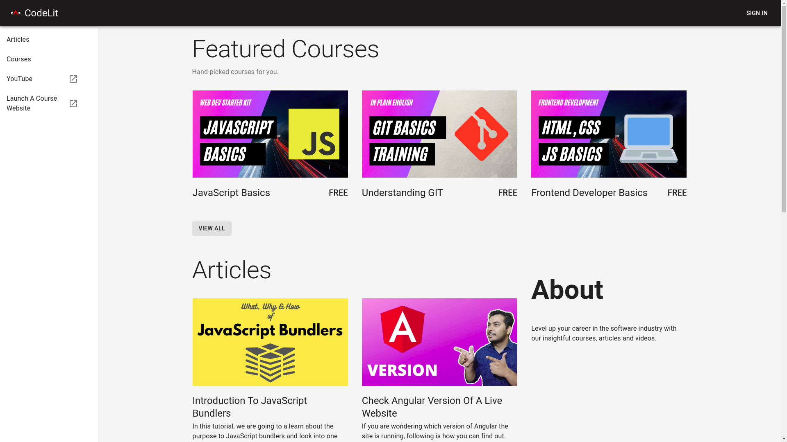

<p align="center">
  
</p>

<p align="center">
  <b>
    <a href="https://courselit.app">Website</a> |
    <a href="https://docs.courselit.app/post/KH9ERinOpM02OgBzA7_8O/hosting-courselit-on-your-own-server">Getting started</a> |
    <a href="https://docs.courselit.app">Documentation</a>
  </b>
</p>

<p align="center">
  <a href="https://github.com/codelitdev/courselit/actions">
    
  </a>
  <a href="https://discord.gg/GR4bQsN">
    
  </a>
  <a href="https://hub.docker.com/r/codelit/courselit-proxy">
    
  </a>
  <a href="https://github.com/codelitdev/courselit">
    
  </a>
  <a href="https://lgtm.com/projects/g/codelitdev/courselit/alerts/">
    
  </a>
  <a href="https://github.com/codelitdev/courselit/blob/deployment/LICENSE">
    
  </a>
</p>

# Introduction

CourseLit is a [batteries included](https://en.wikipedia.org/wiki/Batteries_Included) learning management system (aka LMS) for everyone. It is an open source alternative to Techable, Thinkific, Podia and the likes.

It comes pre-equipped with all the basic tools you'd require to efficiently run and administer your online teaching business. Features include course authoring, student management, payment processing (via Stripe), website customization and analytics (very limited as of now).

Check out this live example to see what you can build with CourseLit. [Click here](https://codelit.dev).

## Screenshot



## Getting Started

To install CourseLit on your cloud server, please follow [our official guide](https://codelit.gitbook.io/courselit/getting-started).

## Development

The project is organised as a [mono-repo](https://en.wikipedia.org/wiki/Monorepo). It uses [Yarn workspaces](https://yarnpkg.com/features/workspaces) for managing the mono-repo.

To set up the development environment, first clone the project on your local machine and `cd` to its diretory.

Then replace the values in `.env` file located inside the `apps/web` folder with your enviroment's configuration.

Now run the following commands from the root directory of the project.

```sh
# Install dependencies
yarn install

# Build the packages
yarn build

# Start the app
yarn dev
```

That's it! Now you can dive into the code base.

## Medialit

CourseLit uses [MediaLit](https://medialit.cloud) as its backend for managing media assets. It is a paid service and you need to have an account on it to store your files in the cloud.

If you do not want to use the cloud hosted version, you can roll your own instance. Add the following config to the `.env` file to use your own MediaLit instance.

```sh
MEDIALIT_SERVER=medialit_server_location
```

## Writing Your Own Widget

You can add additional functionality to your application via building your own widgets. Have a look at [this](widgets.md) document.

## Environment variables.

Have a look at the [docker-compose.yml](../deployment/docker/docker-compose.yml) file to know what all environment variables are available for you to tweak.
