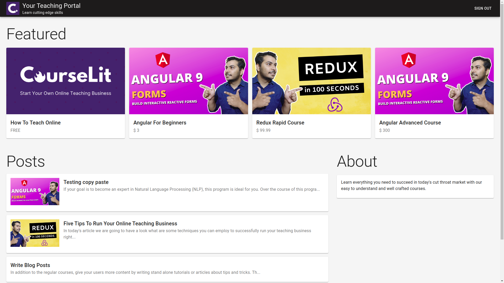

<p align="center">
  
</p>

<p align="center">
  <b>
    <a href="https://courselit.codelit.dev">Website</a> |
    <a href="https://codelit.gitbook.io/courselit/getting-started">Getting started</a> |
    <a href="https://codelit.gitbook.io/courselit">Documentation</a>
  </b>
</p>

<p align="center">
  <a href="https://github.com/codelitdev/courselit/actions">
    
  </a>
  <a href="https://discord.gg/GR4bQsN">
    
  </a>
  <a href="https://hub.docker.com/r/codelit/courselit-proxy">
    
  </a>
  <a href="https://github.com/codelitdev/courselit">
    
  </a>
  <a href="https://lgtm.com/projects/g/codelitdev/courselit/alerts/">
    
  </a>
  <a href="https://github.com/codelitdev/courselit/blob/deployment/LICENSE">
    
  </a>
</p>

# Introduction

CourseLit is a content management system (aka CMS) for starting your own online course website. It is designed keeping educators in mind. Consider it an open-source alternative to those paid tutoring sites.

It comes pre-equipped with all the basic tools you'd require to efficiently run and administer your online teaching business. Features include course authoring, student management, payment processing (via Stripe), website customization and analytics (very limited as of now).

Check out this live example to see what you can build with CourseLit. [Click here](https://codelit.dev).

## Screenshot



## Getting Started

To install CourseLit on your cloud server, please follow [our official guide](https://codelit.gitbook.io/courselit/getting-started).

## Development

The project is organised as a [mono-repo](https://en.wikipedia.org/wiki/Monorepo). It uses [Lerna](https://github.com/lerna/lerna) for managing the mono-repo. You need to run both backend and frontend servers, located in `packages/api` and `packages/app` respectively, in order to run the portal in its entirety.

We recommend using [Visual Studio Code](https://code.visualstudio.com/) for development as it allows you to develop your code in isolation inside a container using the [Remote - Containers](https://marketplace.visualstudio.com/items?itemName=ms-vscode-remote.remote-containers) extension. Install both the editor and the extension.

Once you have this setup, follow these steps.

1. Add the following entries to your operating system's host file. These are required for multitenancy.

```
127.0.0.1       domain1.localsite.com
127.0.0.1       domain2.localsite.com
127.0.0.1       localsite.com
```

2. Press `Ctrl + Shift + P` to open the command palette of Visual Studio Code, type in "Remote-Containers: Open Workspace in Container" and press enter after selecting it.

3. Once the code opens up, open two terminal windows in your Visual Studio Code and type in the following commands to start the backend and frontend servers respectively.

- `yarn lerna run dev --scope=@courselit/api --stream`
- `yarn lerna run dev --scope=@courselit/app --stream`

> The above commands are also exported as `bash` aliases, so you can simply type `api` and `app` in separate terminal windows to run backend and frontend servers respectively.

4. Inside the development container, open up a terminal window and type the following commands in sequence.

```
mongo
use app
db.domains.insert({ name: "domain1" })
db.domains.insert({ name: "domain2" })
```

This will enable the invidual sites listed in step `1`.

5. Visit `domain1.localsite.com` to see CourseLit in action.

## Writing Your Own Widget

You can add additional functionality to your application via building your own widgets. Look at [this](widgets.md) document.

## Environment variables.

**SITE_URL**

The public address of the site. Required parameter. No default value.

**MEDIA_FOLDER**

A folder on your host machine while will be mounted as a volume to all the containers. It is required for storing database files, user uploaded files, ssl certificates and everything else. Required parameter. No default value.

**MONGO_ROOT_USERNAME, MONGO_ROOT_PASSWORD**

These are required for correctly initializing an admin user in the mongo db instance running inside the container named `db`. Read more about these [here](https://hub.docker.com/_/mongo).

**DB_CONNECTION_STRING**

The connection string to a mongodb instance running in the `db` container. Required parameter. The value should be `mongodb://<MONGO_ROOT_USERNAME>:<MONGO_ROOT_PASSWORD>@db` where `MONGO_ROOT_USERNAME` and `MONGO_ROOT_PASSWORD` are the same variables defined above.

**JWT_SECRET**

A random string to use as a secret to sign the JWT tokens the API generates. Required parameter. No default value.

**JWT_EXPIRES_IN**

The duration after while the generated JWT expires. For more information [check out here](https://www.npmjs.com/package/jsonwebtoken). Optional parameter. Defaults to `1d`.

**DOMAIN**

The domain name for which the ssl certificate is issued. Optional parameter, only required if using a SSL certificate. No default value.

**TAG**

The Docker tag. To see what all tags are available, visit [CourseLit on Docker Hub](https://hub.docker.com/repository/registry-1.docker.io/codelit/courselit-proxy/tags).
