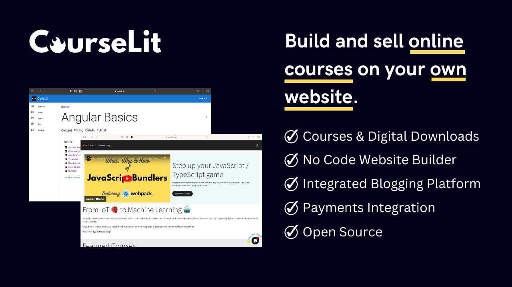
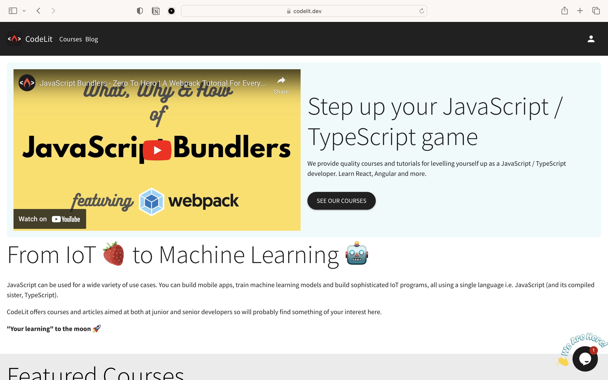
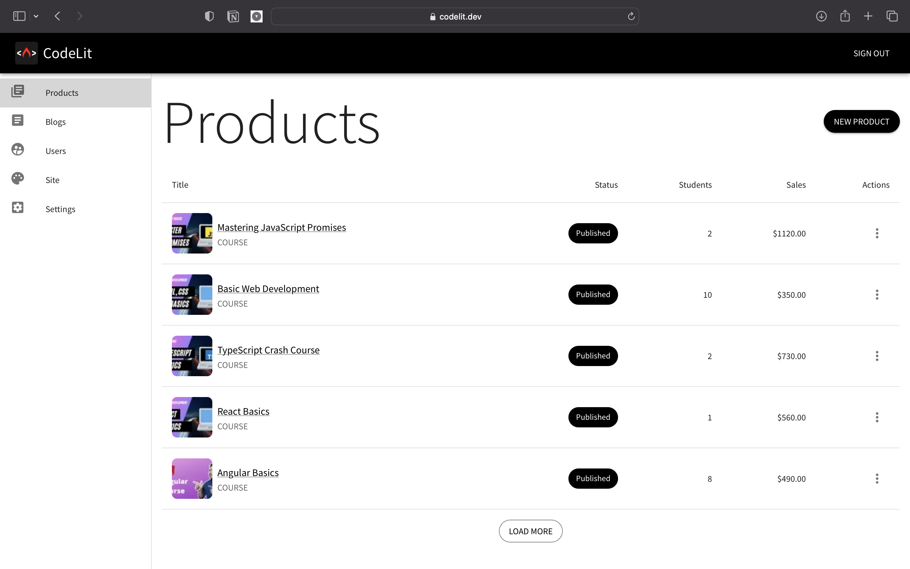

<p align="center">
  
</p>

<h1 align="center">CourseLit</h1>

<p align="center">
    Sell online courses and digital downloads from your own website. 
    <br />
    <br />
    An open source alternative to Teachable, Thinkific, Podia and the likes.
</p>

<p align="center">
  <b>
    <a href="https://courselit.app">Website</a> |
    <a href="https://docs.courselit.app">Documentation</a> | 
    <a href="https://honey-oviraptor-4b7.notion.site/4a82d434ff2e485c8eb4b22f13252fef?v=9873e6e4812c420ab6a5cd81eca11356">Roadmap</a>
  </b>
</p>

<p align="center">
  <a href="https://discord.gg/GR4bQsN">
    
  </a>
  <a href="https://github.com/codelitdev/courselit">
    
  </a>
  <a href="https://github.com/codelitdev/courselit/blob/deployment/LICENSE">
    
  </a>
</p>

# A modern LMS for everyone

CourseLit is a [batteries included](https://en.wikipedia.org/wiki/Batteries_Included) learning management system (aka LMS) for everyone. It is an open source alternative to Teachable, Thinkific, Podia, Teachery, LearnDash and the likes.

It comes pre-equipped with all the basic tools you need to efficiently run and administer your online teaching business. Features include course authoring, student management, payment processing (via Stripe), website builder, custom sales pages and analytics (very limited as of now).

Check out this live example to see what you can build with CourseLit. [Click here](https://codelit.dev).

### Screenshots

**1. A real landing page build with CourseLit**



**2. Admin dashboard**



## Features

Checkout our [documentation](https://docs.courselit.app/en/introduction/#key-features) for an updated list of features.

## Getting started

Visit [courselit.app](https://courselit.app) to use the cloud hosted version. Sign up for a free account to get a 14 days trial period to experience the platform without any restrictions. No credit card required.

To self host CourseLit, follow our [official guide](https://docs.courselit.app/en/self-hosting/).

[](https://vercel.com/new/clone?repository-url=https%3A%2F%2Fgithub.com%2Fcodelitdev%2Fcourselit&env=DB_CONNECTION_STRING,AUTH_SECRET,SUPER_ADMIN_EMAIL,EMAIL_USER,EMAIL_PASS,EMAIL_HOST,EMAIL_FROM&envDescription=Configuration%20for%20your%20app&project-name=courselit&root-directory=apps%2Fweb&build-command=cd+..%2F+%26%26+NODE_OPTIONS%3D--openssl-legacy-provider+yarn+build)

## Development

The project is organised as a [mono-repo](https://en.wikipedia.org/wiki/Monorepo). It uses [Yarn workspaces](https://yarnpkg.com/features/workspaces) for managing the mono-repo.

To set up the development environment, first clone the project on your local machine and `cd` to its diretory.

Then replace the values in `.env` file located inside the `apps/web` folder with your enviroment's configuration.

Now run the following commands from the root directory of the project.

```sh
# Install dependencies
yarn install

# Build the packages
yarn build

# Start the app
yarn dev
```

That's it! Now you can dive into the code base.

## Medialit

CourseLit uses [MediaLit](https://medialit.cloud) as its backend for managing media assets. It is a paid service and you need to have an account on it to store your files in the cloud.

If you do not want to use the cloud hosted version, you can roll your own instance. Add the following config to the `.env` file to use your own MediaLit instance.

```sh
MEDIALIT_SERVER=medialit_server_location
```

## Writing your own widget

You can add additional functionality to your application via building your own widgets. Have a look at [this](widgets.md) document.

## Environment variables

Have a look at the [docker-compose.yml](../deployment/docker/docker-compose.yml) file to know what all environment variables are available for you to tweak.
