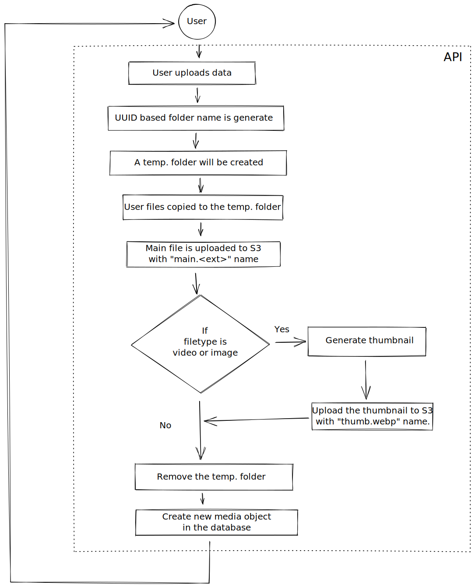

# Media Management

This document describes how CourseLit handles user uploaded media like images, videos, audio, pdf and more. When the service boots up you provide it with certain environment variables detailing where to store the files.

## Thumbnail generation

CourseLit generates thumbnails for image and video files and stores them along with the original file.

## Storage convention

CourseLit saves user files in a pre-defined fashion which is specified below.

```bash
Actual file: <storage-root>/{subdomain-name}/{user-id}/{uuid}/main.webp
Thumbnail file: <storage-root>/{subdomain-name}/{user-id}/{uuid}/thumb.webp
```

## Uploading on S3 compatible cloud storages

If you want to keep user media on a cloud storage, you need to specify the following environment variables for booting up the service correctly.

```bash
USE_CLOUD_STORAGE=true
CLOUD_ENDPOINT=https://cloud.endpoint
CDN_ENDPOINT=https://cdn.endpoint
CLOUD_REGION=region
CLOUD_KEY=key
CLOUD_SECRET=secret
CLOUD_BUCKET_NAME=bucket
```

## Uploading on a local disk

Specify the following environment variable to use local storage.

```bash
USE_CLOUD_STORAGE=false
USER_CONTENT_DIRECTORY=~/courselit-local
CDN_ENDPOINT=https://your-website-address/api/assets
```

## Flow diagram



[Link to the original diagram](https://excalidraw.com/#json=5081053140090880,IjHDBI09H4htO71ODKUAeg)
