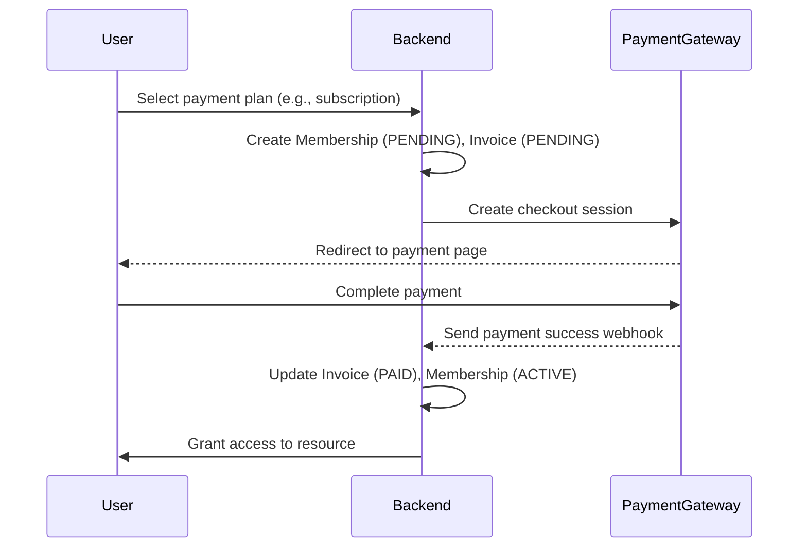
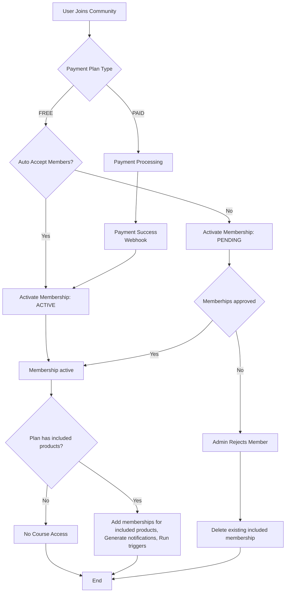

# Memberships, Invoices, and Payment Lifecycle Documentation

## Introduction

This document provides a comprehensive overview of the payment lifecycle for memberships, including **one-time payments**, **subscriptions**, **EMIs**, and **free plans**. The system leverages payment gateways (e.g., Stripe, Razorpay) to handle transactions, with membership statuses and invoices updated dynamically via webhooks.

## Core Components

### 1. **Memberships**

- **Purpose**: Grants users access to entities such as courses or communities.
- **Key Attributes**:
    - **Status**: `ACTIVE`, `PAYMENT_FAILED`, `EXPIRED`, `PENDING`, `REJECTED`, or `PAUSED`.
    - **Subscription ID**: For recurring plans (subscriptions/EMIs), stores the payment gateway’s identifier.
    - **Entity**: The resource (e.g., course ID) the user is accessing.
    - **Payment Plan**: Links to the selected plan (free, one-time, subscription, or EMI).

### 2. **Invoices**

- **Purpose**: Records individual payment transactions.
- **Key Attributes**:
    - **Status**: `PAID` (successful) or `PENDING` (failed/retry).
    - **Payment Processor**: The gateway used (e.g., Stripe).
    - **Linked Membership**: Associates the invoice with a membership.

### 3. **Payment Plans**

- **Purpose**: Represents a payment type. Never deleted—only archived to preserve history.
- **Types**:
    - **Free**: No cost; membership activates immediately or requires approval.
    - **One-Time**: Single payment for lifetime access.
    - **Subscription**: Recurring payments (monthly/yearly) until canceled.
    - **EMI**: A subscription with a fixed number of installments (e.g., 6 payments), automatically canceled after completion.

## Payment Lifecycle

### 1. **Payment Initiation**

- **User Action**: Selects a plan (free, one-time, subscription, or EMI).
- **Membership Creation**:
    - **Free plan**
        - A membership is created with `ACTIVE` status.
    - **Paid plan**
        - A membership is found or created with `PENDING` status.
        - An invoice is generated with the status `PENDING`.
- **Checkout Session**:
    - For paid plans, the payment gateway creates a session ID.
    - The session ID is returned to the user’s browser.
    - The user’s browser is redirected to complete payment.

### 2. **Payment Confirmation (Webhooks)**

- The payment gateway sends appropriate events.
- The webhook checks for the relevant event type (one-time or recurring).
- Metadata is retrieved from the webhook event data.
- The membership is identified using the metadata.
- **For one-time payments**:
    - The invoice record is retrieved from the database and updated to `PAID`.
    - The membership status becomes `ACTIVE`.
- **For subscriptions/EMIs**:
    - If it’s the first payment, the invoice is updated to `PAID`. For subsequent payments, a new `PAID` invoice is created.
    - The membership remains or transitions to `ACTIVE`.
    - **EMI-specific check**: If the number of `PAID` invoices matches the payment plan’s installments, the subscription is automatically canceled. The membership remains `ACTIVE`.

## Diagrams

### Payment flow

## Membership flow

