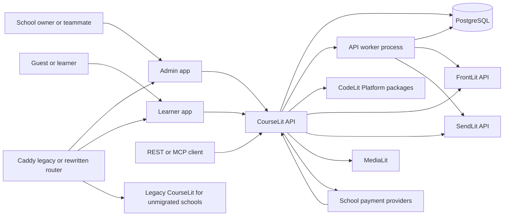
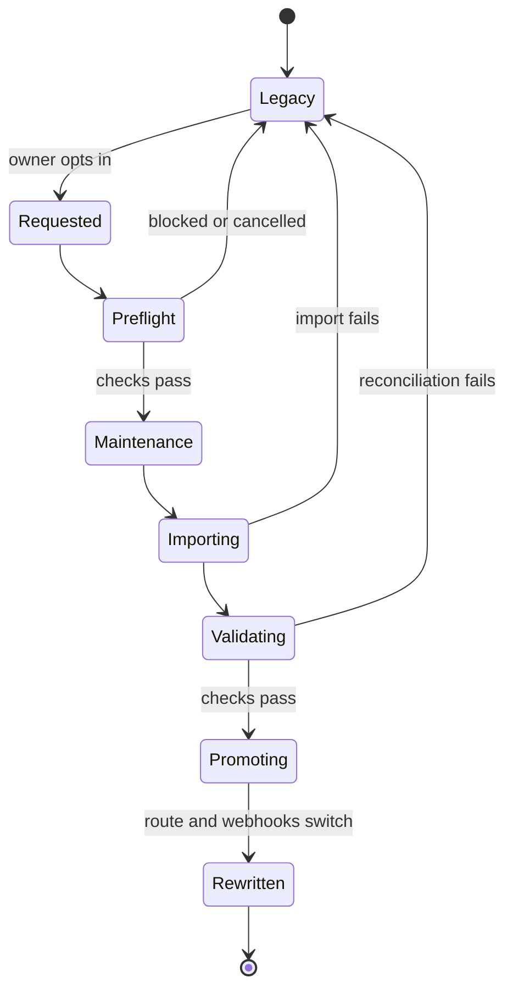

# CourseLit Platform-based rewrite PRD

## Document control

- Status: Draft for review
- Version: 0.5
- Last updated: September 7, 2026
- Owner: CourseLit product and engineering
- Related architecture: `saas-starter-kit/docs/architecture.md`, Phase 6
- Target: a new CourseLit foundation generated from `@codelitdev/platform-cli`
- Existing behavior reference: the CourseLit repository `main` branch; use a read-only reference worktree when practical

> Implementation rule: when a capability already exists in CourseLit, inspect and port/adapt its implementation and tests from `main`. Do not re-invent existing behavior from this PRD alone. The split-target boundaries and any explicit decisions in this PRD take precedence over historical implementation details. The implementation is considered complete only when there is user facing feature parity between the existing CourseLit approach and the ported one.

## 1. Executive summary

CourseLit will be rebuilt on the CodeLit Platform foundation and migrated from its current MongoDB-backed, unified admin-and-learner application to a PostgreSQL-backed, API-first product with separate administration and learner experiences.

This is a replacement program, not an in-place refactor. The new system will be deployed on fresh infrastructure with an initially blank PostgreSQL database and will run alongside the current CourseLit production system.

Rollout begins with a cohort boundary: after an explicitly configured future cutoff, new school signups are provisioned only in the rewritten system. Schools created before the cutoff continue to be served by the legacy system and see an invitation to migrate. When an eligible school owner opts in, that school enters maintenance mode, its data is moved from MongoDB to PostgreSQL, and its routing is switched to the rewritten system after reconciliation. New schools are never dual-written to MongoDB.

The target product has three primary runtime applications. The API workspace has separate HTTP and worker process entry points but shares one codebase, schema, configuration, and build artifact:

| Application                         | Responsibility                                                                                                                                                                                     |
| ----------------------------------- | -------------------------------------------------------------------------------------------------------------------------------------------------------------------------------------------------- |
| CourseLit API (`http` and `worker`) | HTTP serves schools, products, lessons, learners, communities, commerce, REST, OpenAPI, MCP, and webhooks. Worker processes drip, outbox, notifications, imports, reconciliation, and maintenance. |
| Admin app                           | Authenticated workspace for school owners and invited team members                                                                                                                                 |
| Learner app                         | Public school site, learner authentication, course consumption, communities, checkout, and certificates                                                                                            |

The rewrite will use the Platform for common SaaS behavior and retain CourseLit ownership of its product behavior:

- Platform-owned foundation: request context, admin authentication conventions, school membership authorization seams, API keys, invitations, SaaS billing composition, observability, REST/MCP composition, conformance, upgrades, and secure defaults.
- CourseLit-owned behavior: schools, products, lessons, learner identities, enrollments, progress, communities, storefront commerce, sister-product integrations, and the learner experience.
- FrontLit-owned behavior: pages, blog posts, page composition, and public-site content management.
- SendLit-owned behavior: marketing contacts, consent and suppression state, broadcasts, sequences, templates, and email delivery.
- MediaLit-owned behavior: media upload and delivery.

The first implementation goal is a thin, production-shaped vertical slice:

> A school owner can create a school, invite a teammate, create and publish a free course, enroll a learner, and have that learner sign in and complete one lesson through the new stack. The same product read must work through REST and an authorized MCP client, and all requests must carry school-scoped audit and telemetry context.

## 2. Why rewrite

The existing application has accumulated several responsibilities behind one Next.js application and one MongoDB user model:

- admin and learner authentication share the same identity and session model;
- school resolution, subscription verification, and first-user provisioning happen in request middleware;
- learner profile, staff permissions, marketing fields, purchases, progress, and certificates are coupled to the same `User` document;
- internal GraphQL behavior, REST endpoints, UI concerns, and persistence are tightly connected;
- the queue owns both CourseLit-specific drip work and email-marketing automation;
- pages, blog, contacts, and campaigns overlap with newer CodeLit products;
- CourseLit Cloud subscription management lives in a separate application and database boundary.

This makes the system hard to evolve safely and prevents CourseLit from consuming the shared Platform as a normal product. The rewrite creates explicit product boundaries and an independently testable API while preserving the behavior customers depend on.

## 3. Goals

1. Preserve public-facing feature parity for existing schools and learners before any existing school is promoted.
2. Build CourseLit on the generated CodeLit Platform foundation without copying FrontLit or SendLit server code.
3. Separate admin/team identity from learner identity and authentication.
4. Make the CourseLit API the sole application service for admin, learner, REST, and MCP transports.
5. Move application persistence from MongoDB/Mongoose to PostgreSQL/Drizzle with application-owned migrations.
6. Bring school creation, team membership, CourseLit Cloud subscription management, and billing into the CourseLit API so `courselit-subscriptions` can be retired.
7. Keep products, lessons, learners, enrollments, progress, communities, certificates, and storefront checkout CourseLit-owned.
8. Replace CourseLit email marketing with SendLit and CourseLit page/blog management with FrontLit.
9. Use MediaLit for media upload and delivery without exposing MediaLit credentials to browsers or clients.
10. Offer a typed REST API, generated OpenAPI documentation, and an authenticated MCP surface from the same service methods.
11. Preserve subdomain and custom-domain school routing.
12. Provide a rehearsed and observable per-school migration that is abortable before promotion and forward-only after the new system accepts writes.
13. Prove the Platform update path against CourseLit before the new-signup cutoff is enabled.

## 4. Non-goals

- Preserving the current GraphQL API or its internal schema.
- Preserving MongoDB document shapes or MongoDB identifiers as primary keys.
- Rebuilding email campaigns, sequences, segmentation, or delivery inside CourseLit.
- Rebuilding page or blog authoring inside CourseLit.
- Using SendLit contacts as CourseLit authentication or authorization records.
- Using Platform SaaS billing records for learner purchases or storefront entitlements.
- Sharing browser sessions between the admin and learner applications.
- A single big-bang data migration without school-scoped rehearsals and reconciliation.
- Dual-writing new schools to MongoDB merely to create a legacy rollback path.
- Reproducing every current internal admin route before the first vertical slice.
- Extracting new shared Platform packages speculatively. A behavior moves to a shared package only after it is proven reusable.
- Replacing FrontLit, SendLit, or MediaLit with internal forks when their public integration contract is sufficient.

## 5. Success criteria

The rewrite is successful when:

- every active school resolves correctly by CourseLit subdomain and custom domain;
- all active owners and team members can access the right schools with equivalent effective permissions;
- learners can sign in with the methods configured by their school;
- product structure, content, enrollments, progress, drip state, communities, purchases, invoices, and certificates reconcile with the legacy source;
- checkout and payment webhooks are idempotent and do not create duplicate charges or access grants;
- public pages, blog content, contacts, and email automation have an explicit FrontLit or SendLit migration result;
- no API, MCP, admin, learner, worker, or webhook path can cross school boundaries;
- the runtime contract generates OpenAPI and the approved operations have tested REST/MCP parity;
- a Platform ordinary update, minimum-secure update, and source-changing CLI upgrade have each landed through a reviewable pull request;
- Caddy routes every known hostname to exactly one system generation, and new signups after the cutoff are created only in PostgreSQL;
- a migrated school can abort safely before promotion, while incidents after promotion can be recovered within the new PostgreSQL system;
- the old web backend, queue endpoints, and `courselit-subscriptions` are retired after the stabilization period.

Initial service-level targets will be fixed from measured legacy traffic during Milestone 0. The rewrite must be no worse than the measured p95 latency and error rate for login, school resolution, catalog reads, lesson reads, progress writes, and checkout initiation.

## 6. Terminology and identity model

The rewrite uses these terms consistently:

| Term                | Meaning                                                                                               |
| ------------------- | ----------------------------------------------------------------------------------------------------- |
| School              | CourseLit tenant and billable Cloud entity; replaces the ambiguous use of `Domain` as the tenant noun |
| Admin user          | A CourseLit account that can belong to one or more schools                                            |
| School membership   | An admin user's role and permissions within one school                                                |
| Learner             | A school-scoped CourseLit identity that can enroll in and consume products                            |
| Contact             | A SendLit marketing record; not an authenticated CourseLit principal                                  |
| Enrollment          | A learner's access to a product or community, including lifecycle and payment relationship            |
| Progress            | Lesson completion, download, drip, quiz, SCORM, and certificate state associated with an enrollment   |
| Platform billing    | CodeLit charging a school for using CourseLit Cloud                                                   |
| Storefront commerce | A school charging a learner for a CourseLit product or community                                      |

A person may be both an admin user and a learner, but those are distinct principals. Linking them is an explicit product operation; matching email addresses alone must not merge permissions, sessions, or records.

## 7. Product and system boundaries

### 7.1 Ownership matrix

| Capability                   | System of record                      | CourseLit responsibility                                                                                            |
| ---------------------------- | ------------------------------------- | ------------------------------------------------------------------------------------------------------------------- |
| School and admin membership  | CourseLit on Platform                 | Own school profile, invitations, roles, permissions, API keys, and lifecycle                                        |
| CourseLit Cloud subscription | CourseLit using `@codelitdev/billing` | Own school/payer mapping, plan policy, trial, availability, UI, and provider configuration                          |
| Products and lessons         | CourseLit                             | Own all authoring, publishing, ordering, access, drip, quiz, SCORM, and download behavior                           |
| Learner identity and access  | CourseLit                             | Own school-scoped auth, learner record, enrollments, progress, and certificates                                     |
| Communities                  | CourseLit                             | Own community content, memberships, moderation, discussions, reports, and notifications                             |
| Storefront commerce          | CourseLit                             | Own payment plans, connected accounts/configuration, checkout, webhooks, invoices, refunds policy, and entitlements |
| Pages and blog               | FrontLit                              | Store mapping, invoke FrontLit APIs, embed approved authoring components, and render published content              |
| Marketing contacts and mail  | SendLit                               | Store mapping, synchronize lifecycle events, embed approved components, and expose integration health               |
| Media                        | CourseLit catalog backed by MediaLit  | Own the school media library, metadata and reference graph; use MediaLit for file storage, sealing, and delivery    |
| Audit                        | CourseLit through Platform port       | Emit durable business audit events separately from telemetry                                                        |
| Telemetry                    | `@codelitdev/observability`           | Add allowlisted CourseLit context and operate alerts/dashboards                                                     |

### 7.2 Critical boundary decisions

#### Learners versus SendLit contacts

CourseLit owns learner authentication, canonical learner name/email, enrollment, progress, access, and certificates. SendLit owns marketing subscription state, suppression state, tags used for campaigns, segments, broadcasts, and sequences.

Each school maps to a SendLit organization/team, and a CourseLit learner may map to a SendLit contact. Synchronization is asynchronous and idempotent. CourseLit profile changes synchronize outward; a divergent SendLit name or email never overwrites the CourseLit learner automatically. SendLit downtime must not prevent login, checkout, course access, or progress writes. Marketing consent must never be inferred from CourseLit enrollment alone.

#### Platform billing versus storefront commerce

The Platform billing package is used only for the commercial relationship between CourseLit and a school. Storefront commerce remains CourseLit-owned because it controls learner checkout and entitlements. The two areas use separate tables, provider event namespaces, idempotency keys, permissions, webhooks, and audit actions.

#### FrontLit content versus CourseLit products

FrontLit owns pages, blog entries, page-builder content, and site theme data. CourseLit owns products and product access. A FrontLit page may reference a CourseLit product by stable public ID, but it cannot grant enrollment or determine product visibility.

## 8. Target architecture



### 8.1 Runtime applications

#### `apps/api`

- Bun and TypeScript runtime.
- Express with `ts-rest` routes.
- Zod request and response schemas from `@courselit/api-contract`.
- OpenAPI generated from the runtime contract and served at `/docs` with the raw document at `/openapi.json`.
- Better Auth and `@codelitdev/oauth-server-kit` for the admin authorization server.
- A distinct school-scoped learner auth configuration and persistence boundary.
- `@codelitdev/mcp-server-kit` mounted at `/mcp` with OAuth discovery and dynamic client registration.
- Drizzle ORM with PostgreSQL.
- Platform billing, observability, audit, readiness, and shutdown composition.
- Storefront payment and sister-product webhook endpoints.
- Provides `src/main.ts` for the HTTP process and `src/worker.ts` for the worker process.
- The worker process executes CourseLit-owned drip unlocks, transactional outbox delivery, notifications, imports, reconciliation, and maintenance using the same services and schema.
- The worker has no public control API. Operator actions use an authenticated CLI or internal administrative operation. SendLit's CLI can be looked at for an inspiration.
- Neither process recreates SendLit campaign scheduling or delivery workers.

#### `apps/admin`

- Next.js and React admin workspace.
- Uses the CourseLit API contract; it does not access the database directly.
- Uses `@codelitdev/design-system` and shadcn patterns. `@codelit/design-system` has CourseLit specific designs and logo etc.
- Supports school selection, invitations, roles, products, learners, community management, community payment plans, membership moderation, integrations, storefront settings, and Platform billing. Community admin screens are management-only: they must not contain the learner post composer, comment composer, reactions, subscriptions, or learner notifications.
- Embeds FrontLit and SendLit components only through published, versioned package contracts, including `@frontlit/page-builder`, `@sendlit/email-editor`, and `@sendlit/email-blocks` where appropriate. Until a required contract is supported for external consumption, link to the sister product rather than copy its application code.

#### `apps/learners`

- Next.js and React public application.
- Resolves a school from the normalized host, including `<school>.courselit.app` and verified custom domains.
- Serves the storefront, FrontLit-rendered public pages and blog, learner login, product viewer, communities, checkout, downloads, and certificates.
- The authenticated `/dashboard` is a learner workspace and may use an application shell rather than a FrontLit page layout, but it must consume the active school theme so learner workspaces remain visually consistent with the public site.
- Every protected learner route must live under the Next.js `(loggedin)` route group and under `/dashboard`. `/dashboard` is an entry redirect; the primary learner surfaces are `/dashboard/feed`, `/dashboard/products`, `/dashboard/account`, `/dashboard/notifications`, and `/dashboard/community/[communityId]` (including its post/discussion detail routes). Course viewing and lesson discussions use `/dashboard/courses/...`; explicit preview tokens may allow preview rendering without a learner session.
- Feed and Products are top-level learner navigation items, not a nested group or tab strip. Account and Notifications belong in the learner sidebar footer menu.
- Public learner-app routes remain outside the logged-in group: `/products`, `/product/[productId]` (where the stable public product ID uses the `prd_` prefix), `/communities`, `/communities/[communityId]`, `/blog`, `/blog/[blogId]`, the production-compatible `/blog/[slug]/[id]` article URL, `/checkout?session=...`, and `/certificates/[verificationId]`. Public community pages are discovery/detail surfaces; member feeds and participation remain under the protected dashboard community routes.
- Public site routes and system-owned public content are composed like `frontlit/apps/sites`: resolve the school FrontLit page and team theme, render the published layout through `@frontlit/page-builder`, and provide CourseLit-owned dynamic content through named page-builder data slots.
- Public-site-owned UI must use the published `@frontlit/page-builder` blocks, primitives, and components. Do not create a second public-site block or theme system in the learner app.
- Treat the learner app as two explicit surface classes: public-site routes (guest storefront, public product/catalog pages, public pages, and blog) and learner workspace routes (authenticated dashboard, enrollment, progress, lesson viewing, checkout, downloads, communities, community posting/commenting/reactions/subscriptions, learner notifications, and certificates). The second class may use an application shell, but it still consumes the active school theme.
- Community functionality is intentionally split across applications. `apps/admin` owns community creation and settings, categories, learner membership approval and roles, payment plans, reports, moderation, and other administrative controls. `apps/learners` owns the member experience: discovering and joining communities, reading and creating posts, comments/replies, reactions, post subscriptions, reporting, and learner-facing notifications. Reuse the production `main` community components, hooks, validators, and tests where compatible, adapting only their transport, identity, and application-boundary seams.
- The public `/products` route is a CourseLit system-owned catalog surface. It must be rendered inside the school’s active FrontLit theme using the homepage’s shared `header` and `footer` blocks plus an empty themed `Section` containing the CourseLit catalog. It must not require a persisted FrontLit `/products` page or become an isolated custom page with its own header, footer, theme tokens, or card system.
- Public product detail/sales surfaces follow the same composition rule. If a system-owned route has no dedicated FrontLit page, it may fall back to the school homepage layout for shared chrome and inject its content through a named data slot. This does not make the CourseLit product model a FrontLit model: FrontLit owns presentation/layout, while CourseLit owns product visibility, pricing, enrollment, and access decisions.
- The public checkout flow preserves the production sequence: `/products` links to `/product/:productId`; the product page renders CourseLit-owned, FrontLit-primitive blocks for the curriculum and purchase plans; selecting Buy now or Get access creates a short-lived server-side checkout intent; the browser continues at `/checkout?session=<opaque-session-id>`. The query value must not contain payment credentials, learner identity assertions, or trusted price data. If the learner is not authenticated, the checkout route returns through the configured learner login methods and then resumes the same intent. Free plans complete enrollment through the API; paid plans are created through the school's selected Stripe, Lemon Squeezy, or Razorpay adapter and return to the checkout route for status display. The API webhook, not the browser return, confirms payment and grants entitlement.
- Use `@frontlit/page-builder` primitives for public CourseLit-owned headings, cards, images, badges, sections, text, and actions. Do not use `@codelitdev/design-system` or one-off HTML/CSS components for public-site-owned UI unless a required primitive is unavailable; record that intentional exception in the parity ledger.
- Public data loaders must resolve the school from the request host and use only public/learner API contracts. Never select a school from a browser-supplied ID alone, and never expose admin credentials or sister-product secrets to public components.
- Uses only learner/public API endpoints and never receives admin bearer tokens or Platform API keys.

#### `apps/docs`

- Product and developer documentation, including generated OpenAPI reference.

### 8.2 Repository strategy

The generated foundation will be created in a clean branch `platform-based-rewrite` and deployed as parallel services. The legacy production branch remains independently deployable during the migration. This avoids mixing the current pnpm workspace and the new Bun workspace in one dependency graph.

The target workspace is:

```text
apps/
  api/
  admin/
  learners/
  docs/
packages/
  api-contract/
  course-content/
  learner-ui/
  integration-clients/
```

Packages are introduced only where two or more applications need the same stable contract or UI behavior. Server business logic remains in `apps/api` unless reuse is demonstrated. The generated Platform manifest and managed-file hashes remain intact so `platform-cli doctor` and `platform-cli upgrade` continue to work.

The target workspace uses Bun, matching the Platform preset. Existing reusable CourseLit packages are ported selectively; the rewrite must not carry every legacy workspace forward by default.

FrontLit and SendLit integrations may consume their supported alpha packages while those products remain pre-stable. Every alpha dependency is pinned to an exact version; CourseLit does not depend on moving `alpha` tags or semver ranges. Upgrades arrive through reviewed pull requests with contract, typecheck, test, build, and migration evidence.

All rich-text editing and rendering across the platform uses the `@frontlit/text-editor` package. Admin and other authoring surfaces use its TipTap-based `Editor`, while learner and public surfaces use its renderer and shared editor styles. Do not create a second TipTap wrapper or platform-specific rich-text implementation. The package is declared directly by each application that imports it and pinned to an exact reviewed version. Persist document-shaped content as TipTap/ProseMirror JSON, normalize legacy plain text at the boundary, and keep binary assets in MediaLit rather than embedding them in document state. This does not override field-level parity: before choosing a PostgreSQL type, inspect the corresponding `main` model and persistence path. A legacy field that is explicitly string-backed (for example, `Course.description`) remains text unless an approved migration changes its contract.

All CourseLit media and file upload surfaces use the published `@frontlit/media-uploader` package. The host application supplies adapters for CourseLit authorization, MediaLit upload/finalization, school-scoped library listing, and (when configured) server-side Unsplash search. Use `MediaUploadDialog` for general files and `ImageUploadDialog` for images so administrators can upload new assets or reuse existing library media through one consistent flow. Do not import media-uploader source files from the FrontLit repository or recreate its dialogs in CourseLit. Pin the package to an exact reviewed version and keep the adapter boundary free of MediaLit secrets.

FrontLit and SendLit are implementation details, not CourseLit user-facing products. End-user and administrator UI must use CourseLit language such as website, pages, blog, email, and media library; it must not expose provider/product names, integration endpoint names, or provisioning terminology. Integration health may be shown only through a generic CourseLit status or actionable message when a user needs to take action.

### 8.3 Existing CourseLit behavior reference and porting rule

The `main` branch is the source of truth for existing CourseLit behavior that the rewrite is required to preserve. This includes current user-visible workflows, route behavior, authorization outcomes, validation, error handling, side effects, integrations, background jobs, deletion behavior, and edge cases. The rewrite must not re-invent an existing CourseLit feature from the PRD summary alone.

#### Reuse-first implementation rule

Wherever compatible code already exists in `main`, copy and adapt that production-tested implementation into the target rather than rewriting it from scratch. This applies to UI components, hooks, business logic, utilities, validators, serializers, formatters, API handlers, persistence helpers, and regression tests. Before creating a new implementation, search the `main` worktree and existing reusable packages for the corresponding behavior. Reuse the proven code and preserve its behavior, changing only the imports, API/persistence seams, ownership boundaries, package interfaces, and UI conventions required by this PRD and the target architecture.

Copied code must become part of the target repository and must not retain runtime imports from the read-only `main` worktree. Do not copy the legacy application wholesale or carry forward obsolete framework, transport, tenancy, or integration boundaries; selectively reuse the smallest production-tested units that implement the required behavior. A from-scratch replacement is permitted only when no suitable implementation exists or when an explicit PRD decision requires materially different behavior, and the parity ledger must record that reason.

Before implementing a capability that already exists in CourseLit, engineers must inspect its implementation and tests on `main`, then record the target disposition in the parity ledger. The implementation should reuse the smallest suitable production-tested units and port or adapt them to the target architecture; only the legacy application as a whole must not be copied wholesale. In particular:

1. Preserve the externally observable behavior unless this PRD explicitly changes it.
2. Adapt the behavior to the target ownership boundaries, PostgreSQL schema, API contracts, separate admin/learner applications, and Platform conventions.
3. Carry over relevant validation, permission checks, idempotency, deletion rules, integration behavior, and regression tests.
4. Add target-side parity tests and link their evidence from the parity ledger.
5. If the PRD intentionally changes a behavior, document the difference and test the new behavior instead of silently inheriting `main`.

#### Mandatory feature porting brief and parity gate

The preceding comparison is a blocking implementation gate, not a retrospective documentation task. Before writing or changing target code for an existing capability, create or update a feature-level entry in the parity ledger that links the relevant `main` source and tests and records all of the following:

- every user entry point, route, screen, breadcrumb, navigation location, visible control, conditional panel, empty/loading/error state, and screen hierarchy in scope;
- the source models, field names and types, defaults, enumerations, indexes, relationships, ordering rules, and automatically created records;
- create, read, update, delete, reorder, preview, publish, and other applicable operations, including validation and error behavior;
- authentication, authorization, tenancy, visibility, read-only, and ownership-transfer rules;
- side effects such as jobs, notifications, email, media reconciliation, analytics/audit records, and calls to external or sister products;
- the relevant production regression tests and the target tests or other evidence that will prove parity.

Each discovered behavior must have exactly one explicit target disposition: **port unchanged**, **adapt to target architecture**, **replace through an approved integration**, **defer to a named milestone**, or **retire by an explicit PRD decision**. Adapted, deferred, replaced, and retired items must state the reason and must not disappear from the implementation scope merely because the initial target schema, API, or screen does not contain them.

Implementation may begin only after this brief exists. A minimal target CRUD path, a compiling screen, or a passing target-only test does not establish parity. Before handoff, compare the completed target journey side by side with `main`, update the ledger with file/test evidence, and account for every item in the brief. A capability must not be reported as complete while any in-scope item has no disposition or evidence.

The precedence order is: explicit decisions in this PRD, then existing behavior on `main` for unchanged capabilities, then the generated Platform conventions. A new feature with no production counterpart may be designed from the requirements in this PRD, but it must not be treated as permission to replace an existing implementation without review.

The preferred local setup is a separate, read-only worktree checked out from `main`, for example:

```bash
git worktree add <reference-worktree> main
```

Use that worktree for source and test comparison while making changes only in `platform-based-rewrite`. If a worktree is not practical, use `git show main:<path>` or an equivalent read-only comparison. Do not copy secret-bearing environment files, connect reference tooling to production, or modify the reference worktree as part of rewrite implementation.

When porting a rich-text workflow from `main`, retain the production editor and renderer behavior through `@frontlit/text-editor`; adapt only the API, MediaLit picker, permissions, and persistence seams required by the target architecture. Future agents must check this rule before adding any editor, lesson content form, product description field, page content field, email content field, or learner content renderer.

The legacy application historically rendered some learner navigation in the same dashboard shell. In the split target, learner-only navigation stays in `apps/learners`: Feed and Products are top-level learner navigation items, with Account and Notifications in the learner account menu. None of these learner items belong in the `apps/admin` sidebar. Existing admin navigation should retain the production information architecture—Create (Overview, Products, Communities, Blogs, Pages, Users, Mails, and Settings), nested Mails/Settings sub-navigation (Users links directly to `/learners` as standalone `/learners/tags` is retired in favor of direct SendLit contact tagging), Support, and the account menu—subject to the target features that have been migrated.

## 9. Functional requirements

### 9.1 Schools, admin users, and teams

- An account can own or join multiple schools.
- A school has a stable public ID, name, subdomain, optional verified custom domains, status, locale, currency, and integration mappings.
- School creation is available to authorized Cloud accounts and follows billing policy.
- Owners can invite team members by email, resend or revoke invitations, and assign bounded roles or permissions.
- Invitation expiry, email matching, consume-once behavior, idempotency, and last-owner protection follow Platform conformance requirements.
- API keys are school-bound, displayed once, stored as digests, scope-limited, expirable, rotatable with bounded overlap, and immediately revocable.
- Every admin action resolves an authenticated account and an authorized school membership. A caller-provided school ID never establishes tenancy by itself.
- Deleting an admin account requires transfer of owned CourseLit resources and must not delete an independently linked learner identity.

### 9.2 Admin authentication and authorization

- Admin authentication uses the Platform Better Auth and OAuth server conventions.
- Browser sessions are accepted only on admin browser routes.
- REST accepts the credential kinds explicitly allowed by each operation.
- MCP accepts an OAuth bearer token or an explicitly supported school API key; it does not accept browser session cookies.
- Ambiguous or invalid credentials fail closed without falling back to a weaker credential.
- Permissions are defined at the service operation level and shared by REST and MCP transports.
- Initial permission families are: school, billing, team, API keys, products, learners, communities, storefront, integrations, media, and audit.

### 9.3 Learner authentication

- Learner identity is scoped to one school, with unique normalized email per school where email is present.
- Learner identity is always school-local. The rewrite does not create a global learner account shared across schools.
- A school can enable supported methods such as email OTP, Google, and SAML/OIDC SSO.
- Learner auth accounts, sessions, provider links, verification state, and SSO configuration are stored separately from admin auth tables.
- Admin cookies and learner cookies use distinct names, paths/audiences, and session validation.
- School host resolution occurs before learner authentication and is server-verified.
- An identity from one school cannot be replayed against another school's host.
- Account linking is explicit and audited. Email equality is not sufficient to link accounts.
- The supported admin-to-learner link flow is an admin-authenticated, short-lived,
  single-use handoff. The admin app creates the handoff for the current school;
  after the learner authenticates with any configured learner method, CourseLit
  links that learner principal to the initiating admin principal. The handoff
  carries no email-based identity assertion and is never accepted as a reusable
  learner credential. Provider identities (OTP, password, social, and SSO) link
  to the learner principal first; they do not link directly to an admin user.
- Deactivated learners cannot create sessions but their historical commercial records remain subject to retention policy.

### 9.4 Products and lessons

The first release preserves courses and digital downloads. The legacy `blog` course type is migrated to FrontLit rather than represented as a CourseLit product type.

CourseLit must support:

- a public learner storefront at `/products` for the current school host, showing only published/public Courses and Digital downloads and linking to their public product detail/sales surfaces; its layout, header/footer, theme, and CourseLit-owned catalog components must follow the `apps/sites`/`@frontlit/page-builder` data-slot composition described in Section 8.1;
- an admin Products catalog that groups Courses and Digital downloads under one
  Products area, preserves the `main` card hierarchy and terminology, separates
  Public/Hidden from Published/Draft state, shows school-currency-prefixed sales
  and customer counts, and retains the source filter, loading, empty, and
  pagination behavior; target listing transports use the PRD cursor-pagination
  convention where the source uses page-number pagination;
- draft, published, public, and unlisted products;
- stable slugs and public IDs;
- Product slugs preserve the source `Course.slug` string contract and `main`'s
  `validateSlug` normalization/uniqueness behavior; do not require callers to submit
  a pre-normalized kebab-case value.
- course sections with deterministic ordering;
- text, video, audio, PDF, file, embed, quiz, and SCORM lessons;
- published/unpublished lessons and optional enrollment requirements;
- lesson `downloadable` as a Boolean defaulting to `false`, preserved on lesson
  create, update, and learner-facing reads;
- relative and fixed-date drip rules;
- drip-release email notification configuration follows the `main` behavior and is
  ported with the SendLit delivery integration; until Milestone 7, authoring must
  expose the scheduling behavior without persisting a partial email configuration;
- downloadable products and lesson assets;
- course certificates;
- course-level discussions;
- author ownership and explicit ownership transfer;
- free, one-time, subscription, and installment storefront plans;
- included-product entitlements;
- preview without creating enrollment, progress, drip, payment, or certificate state.

Text content will use TipTap/ProseMirror JSON through `@frontlit/text-editor`. Binary content remains in MediaLit. Product reads return an access-filtered representation; clients do not receive locked or unpublished content and then decide whether to hide it.

Public learner rendering is a composition boundary, not a replacement for the
FrontLit site. A public CourseLit route must first resolve the current school,
the requested published FrontLit page (or the homepage fallback for a system
route), its team settings/theme, and its published widget layout. CourseLit then
loads its route-specific data through a named `data-slot` and passes the complete
layout, theme, page data, and slot values to the published `@frontlit/page-builder`
`PageRenderer`. The learner app must not duplicate FrontLit’s header/footer,
theme-resolution, block registry, or public card primitives. Authenticated
`/dashboard` and course-learning workflows are allowed to remain application-shell
routes, but they must use the school-resolved theme and must not be mistaken for
the public-site rendering path.

### 9.5 Learners, enrollments, and progress

- Replace the legacy `User.purchases` array with normalized learners, enrollments, enrollment access grants, and progress records.
- Enrollment lifecycle preserves active, payment-failed, expired, pending, rejected, and paused states.
- Enrollment records capture the source: free signup, admin grant, storefront purchase, included product, import, or integration.
- Progress supports lesson started/completed, downloads, accessible dripped sections, last drip time, quiz attempts/results, SCORM runtime state, course completion, and certificate linkage.
- Progress writes are idempotent and concurrency-safe.
- Course completion and certificate issuance are derived by CourseLit services, not trusted from client input.
- Admins can invite, enroll, suspend, restore, and remove learners subject to commerce and retention rules.
- When an admin is explicitly linked to a learner identity, admin-owned
  community memberships are reconciled into that learner's membership rather
  than producing a second member. A learner join request must therefore be
  idempotent across the linked admin and learner principals. Leaving a linked
  admin-owned membership must not remove the admin's ownership.
- Product rosters and progress reports use stable cursor pagination and export jobs for large results.

### 9.6 Preview mode

- An authorized product manager requests a short-lived, single-purpose preview grant from the admin API.
- The learner app consumes the grant for one school and product.
- Preview can expose unpublished and dripped content only within the manager's authorization.
- Preview never creates or mutates learner, enrollment, progress, certificate, checkout, or notification records.
- An enrolled manager using normal learner authentication receives the ordinary learner experience unless a preview grant is active.

### 9.7 Communities and discussions

- Preserve communities, categories, pages, membership requests, auto-accept policy, roles, posts, comments, flat replies with reply context, reactions, subscriptions, reports, moderation, and notifications.
- Split the user experience between applications: community authoring and administration (including payment plans, membership management, settings, reports, and moderation) belongs in `apps/admin`; community participation (feed, posts, comments/replies, reactions, subscriptions, reports, and notifications) belongs in `apps/learners`. Do not duplicate learner posting or notification controls in the admin app merely because the legacy `main` portal combined both surfaces.
- Reuse/adapt the smallest production-tested community components and logic from `main` instead of replacing them with newly invented flows. The split is an application boundary change, not permission to change observable community behavior.
- Preserve product/lesson discussions and their separate moderation workflow.
- All listing APIs use cursor pagination with stable tie-breakers.
- Soft deletion, anonymization, hard deletion, and report retention rules are explicit per entity.
- Visibility is resolved on the server from school, learner, enrollment, drip, and preview context.

### 9.8 Storefront commerce

- Preserve free, one-time, recurring subscription, and fixed-installment plans.
- Preserve community approval behavior and included-product access grants.
- School learner commerce supports Stripe, Lemon Squeezy, and Razorpay through one payment-provider contract. Each school selects one provider and stores its credentials encrypted at rest.
- The provider adapters cover checkout, customer/subscription references, webhook signature verification, one-time purchases, recurring subscriptions, installments, cancellations, failed renewals, refunds, and disputes.
- Provider configuration belongs to the school commerce domain and is independent of `@codelitdev/billing`, which controls CourseLit platform billing.
- Payment plans and invoices are immutable where required for financial history; plans are archived rather than deleted once used.
- The source default payment plan cannot be archived; administrators must select another active plan as default before archiving it.
- A payment plan does not own or accept a currency. Currency is centrally configured on the school, projected into active-plan responses, and copied into checkout/payment/invoice snapshots when a transaction is created. Plan create/update contracts must ignore or reject client-supplied currency rather than persisting it.
- Payment-plan field parity with `main` is required: preserve the source `type` values
  `free`, `onetime`, `emi`, and `subscription`, together with the separate numeric
  fields `oneTimeAmount`, `emiAmount`, `emiTotalInstallments`,
  `subscriptionMonthlyAmount`, and `subscriptionYearlyAmount`. Before choosing a
  PostgreSQL type or collapsing fields into a provider adapter shape, inspect
  `packages/common-models/src/payment-plan.ts` and
  `packages/orm-models/src/models/payment-plan.ts` in the `main` worktree. Any
  minor-unit amount or billing interval used by a provider adapter is a derived integration value,
  not a replacement for the source payment-plan fields.
- EMI is represented by a monthly payment amount and a total installment count in the
  product; it does not have a user-configurable frequency field. A payment adapter may
  derive a monthly interval internally, but the admin dialog must not expose subscription
  frequency controls for EMI.
- Preserve the source duplicate-plan rules: active products allow one `free`, one
  `onetime`, and one `emi` plan, plus one monthly and one yearly `subscription` plan;
  plan names are not the uniqueness key. Product-owned plans reject `includedProducts`.
- Checkout initiation is idempotent and binds school, learner, product/community, plan, currency, and an expected amount.
- Public checkout intents are short-lived, school-scoped, and server-backed. They bind the selected published product and plan before learner authentication, are claimed by exactly one learner when checkout starts, and expire without creating enrollment or payment state. The checkout attempt created from the intent remains idempotent and learner-bound.
- Webhooks verify provider signatures, store the provider event before processing, and process an event at most once.
- Entitlements are granted from verified server-side payment state, never from the browser redirect alone.
- Refund, cancellation, failed renewal, installment completion, and dispute effects are specified and tested per provider.
- Provider credentials are encrypted and redacted from logs and API responses.

Learner checkout configuration is managed by school administrators through the
CourseLit API. The selected provider's secret credentials are encrypted at rest
and never returned to the learner app. Checkout attempts are bound to the school,
learner, product, plan, currency, and expected amount before a hosted checkout
URL or provider checkout data is returned. Access is granted only from a verified
Stripe, Lemon Squeezy, or Razorpay webhook; the browser return URL is not an
entitlement signal.

### 9.9 Platform billing

- A school is the billable entity; a payer identity is explicitly mapped to it.
- CourseLit Cloud has no free plan.
- A new Cloud school receives a product-owned 14-day trial.
- Trial expiry and subscription state place the school into read-only mode.
- In read-only mode, public pages and already entitled course/community content remain readable. Admins can inspect/export data and access the billing recovery flow.
- Read-only mode blocks authoring, invitations, API-key mutations, new enrollments, checkout, progress/quiz/SCORM writes, community writes, and new drip unlocks. Existing downloads remain readable when the learner already has access.
- Safety-critical system writes continue in read-only mode, including subscription/payment webhooks, audit records, authentication/session security actions, integration reconciliation, deletion/retention work, and the billing action that restores service.
- REST and MCP mutations rejected by this policy return one stable `school_read_only` product error rather than transport-specific behavior.
- OSS composition does not depend on a hosted provider and uses the billing package's supported OSS/fake-provider path.
- Billing schema is generated from the published package, checked in, and migrated by CourseLit.
- Product effects and audit hooks are required for Cloud billing actions.
- Shared billing improvements are made in `@codelitdev/billing`, validated in SendLit, published, and then consumed by CourseLit. CourseLit does not copy or fork billing internals.

### 9.10 FrontLit integration

- The CourseLit deployment receives these server-side settings:

    ```dotenv
    FRONTLIT_SERVER=
    FRONTLIT_APIKEY=
    ```

- `FRONTLIT_SERVER` is the FrontLit API origin. `FRONTLIT_APIKEY` is FrontLit's provisioning credential and is used only from the CourseLit API/worker boundary.
- Each school maps one-to-one to a FrontLit team/site provisioned with the CourseLit school public ID as its immutable external ID.
- Provisioning is idempotent. CourseLit supplies the school name and owner identity required by the FrontLit contract.
- FrontLit returns the provisioned team ID and its team API key. The team API key is returned only when the team is first created, so CourseLit must persist it immediately in the school's integration record, encrypted at rest.
- Before production rollout, FrontLit's provisioning lifecycle must provide an authenticated way to replace a lost school team key. An idempotent replay cannot return the original plaintext key and must not strand a partially provisioned school.
- The deployment-level `FRONTLIT_APIKEY` and the returned school-level team API key have different purposes and must not be substituted for one another.
- Pages, navigation, blog posts, page-builder content, and public theme data are authored and stored in FrontLit.
- The CourseLit admin app launches or embeds `@frontlit/page-builder` only through its published package contract.
- The learner app renders a published FrontLit snapshot and CourseLit product blocks through stable public IDs.
- Learner route organization is part of the public contract: authenticated screens are grouped under `(loggedin)/dashboard`, while public catalogs, public community detail, blog, and certificate verification remain outside that group. A route-group move must preserve the URL semantics listed in Section 8.1 and update API-generated notification links along with browser links.
- An unsupported migrated FrontLit block is preserved without transformation and displayed as `Unsupported` in both the admin page builder and learner-site renderer. It must not crash or disappear silently. The placeholder may identify the block type but must not expose raw configuration or secrets.
- Server integration uses a stable, externally supported FrontLit API. CourseLit must not import FrontLit's private workspace contract or server modules.
- CourseLit stores only mappings, synchronization state, and any bounded cache needed for resilient public rendering.
- FrontLit failure must not affect course viewing, learner progress, or checkout. Public content degradation behavior and cache TTL are documented.
- School creation commits locally and enqueues FrontLit provisioning through the CourseLit outbox; a temporary FrontLit outage leaves the integration in a visible `pending` state rather than rolling back the school.
- FrontLit provisioning is an asynchronous, idempotent CourseLit worker flow: it persists the returned one-time team key before follow-up calls, requests exactly the three non-deletable CourseLit pages (`/`, `/terms`, and `/privacy`) in the FrontLit provisioning payload, and claims the CourseLit school subdomain in FrontLit. The learner app does not require persisted FrontLit pages for `/blog`, `/products`, or `/communities`: these CourseLit system routes reuse the homepage’s published `header` and `footer` blocks and place their route-specific content inside an empty themed `Section` from `@frontlit/page-builder`. Blog content comes from published school blog posts; products and communities remain CourseLit-owned surfaces. CourseLit must not create or require FrontLit-specific Docs, Help, or Changelog pages during school creation; those remain owned by FrontLit. CourseLit must not copy FrontLit's private page seed/layout implementation or maintain a second page model. Existing teams provisioned before this scoped page list was supported are not destructively cleaned up by CourseLit; any cleanup must be an explicit, separately reviewed migration.
- Every CourseLit product and community has a CourseLit-owned mapping to a FrontLit sales page. The mapping is created in the same local transaction as the product/community and is reconciled asynchronously after the school's FrontLit team becomes available; a FrontLit outage must not block authoring or checkout. Sales pages use a reserved CourseLit slug namespace and are omitted from the ordinary admin `/pages` list, while product/community settings expose an `Edit page` link to the page builder once the remote page is ready. The page layout uses FrontLit's existing `banner` block as the non-deletable sales hero followed by a locked `data-slot`, with the checkout/join action pointing at the CourseLit-owned product/community route. The learner route renders the published FrontLit sales-page layout and resolves that slot with the CourseLit-owned curriculum, purchase, or community content inside FrontLit's themed `Section`; a new CourseLit block is added only if the supported FrontLit block registry cannot express the required behavior.
- The public blog index is `/blog`; each published post is rendered at `/blog/:slug/:id`, where `slug` resolves the published article through the supported FrontLit public API and `id` must match the returned stable document ID. The detail view uses the same homepage `header`/`footer` chrome and themed `Section`, and renders article TipTap/ProseMirror content with `@frontlit/text-editor`.
- CourseLit will provision and own each school's SendLit team independently in the SendLit integration milestone. FrontLit's optional SendLit connection is an internal FrontLit concern and must not be used as a prerequisite, fallback, or dependency for CourseLit school provisioning or learner-site operation.
- Provisioning, credential rotation, webhook verification, deletion, retry, and reconciliation are automated and auditable.

### 9.11 SendLit integration

CourseLit will provision and own each school's SendLit team independently of
FrontLit. FrontLit may have its own SendLit connection for FrontLit-owned
features, but CourseLit must not depend on that connection, its team mapping,
its retry outbox, or its system templates. The CourseLit SendLit provisioning,
event synchronization, retry, and template flows are intentionally deferred
to the SendLit integration milestone and must use CourseLit's own supported
SendLit boundary when implemented.

- The CourseLit deployment receives these server-side settings:

    ```dotenv
    SENDLIT_SERVER=
    SENDLIT_APIKEY=
    ```

- `SENDLIT_SERVER` is the SendLit API origin. `SENDLIT_APIKEY` is an organization API key with the required team-provisioning/lifecycle scopes. The authenticated key determines the SendLit organization; CourseLit must not accept an organization ID from a school or client.
- Each CourseLit school maps one-to-one to a SendLit team inside that organization, using the CourseLit school public ID as the immutable external ID.
- Provisioning is idempotent within the configured SendLit organization.
- SendLit returns the team ID and an initial team API key only on first creation. CourseLit must persist that key immediately in the school's integration record, encrypted at rest. Replaying the provisioning request cannot recover it.
- The deployment-level `SENDLIT_APIKEY` is used for team provisioning and lifecycle operations. The returned school-level team API key is used for that school's contacts, templates, broadcasts, sequences, and delivery APIs.
- School creation commits locally and enqueues SendLit provisioning through the CourseLit outbox; a temporary SendLit outage leaves the integration in a visible `pending` state rather than rolling back the school.
- Server integration uses a stable, externally supported SendLit API. CourseLit must not import SendLit's private workspace contract or server modules.
- CourseLit publishes learner/contact created, profile changed, consent changed, enrollment changed, purchase completed, course progress, and community membership events through a transactional outbox.
- Event payloads are versioned, school-scoped, minimal, and idempotent.
- SendLit is authoritative for marketing opt-in, suppression, tags, segments, broadcasts, sequences, templates, and delivery history.
- Authentication OTP and essential transactional messages use an explicitly approved transactional delivery path; they are not contingent on marketing consent.
- Existing CourseLit email sequences and related queue jobs are not ported. Required active automations are migrated to SendLit with a per-school reconciliation report.
- SendLit outage does not block CourseLit writes; failed deliveries retry with limits and surface integration health to operators.
- Deletion and unsubscribe flows coordinate without silently resubscribing a suppressed address.

### 9.11.1 Shared provisioning credential rules

- All four settings are deployment-level secrets. They are never returned through REST, MCP, OpenAPI examples, browser configuration, logs, audit payloads, or migration reports.
- Development, staging, and production use different remote organizations/instances and credentials so non-production schools cannot be provisioned into production.
- Startup validates setting syntax without making either sister product a startup-time network dependency. Connectivity and credential-scope checks are exposed through readiness diagnostics and operator tooling.
- Provisioning jobs use bounded timeouts and retries. A permanent authentication or scope failure moves the integration to `action_required` instead of retrying forever.
- The per-school integration record stores provider, server identity, external school ID, remote team ID, encrypted team key, provisioning status, last successful synchronization, and a redacted last error.
- The provisioning key is never used as a fallback for ordinary team data access. This preserves isolation between CourseLit schools under the same SendLit organization or FrontLit deployment.
- Deployment credential rotation and school team-key rotation are separate, audited procedures.

### 9.12 MediaLit integration

CourseLit follows SendLit's centralized media-library pattern. MediaLit stores and delivers the binary; CourseLit owns the tenant-scoped catalog and knows where each retained asset is used.

The CourseLit deployment receives these server-side settings:

```dotenv
MEDIALIT_SERVER=
MEDIALIT_APIKEY=
```

- `MEDIALIT_SERVER` is the MediaLit API origin. `MEDIALIT_APIKEY` remains inside the CourseLit API/worker boundary.
- The API issues short-lived, school- and purpose-scoped upload authorization only after CourseLit permission checks. Clients never receive `MEDIALIT_APIKEY`.
- Browser uploads use MediaLit's resumable TUS endpoint (`/media/create/resumable`) with the short-lived signature. The completed upload returns the MediaLit asset metadata in the `Media` response header; CourseLit then seals/registers that asset through its API. The browser must never call MediaLit with the deployment API key.
- Admin upload and selection UI uses the published `@frontlit/media-uploader` package. CourseLit supplies the school-scoped upload, library, and optional Unsplash adapters; it does not import FrontLit's private uploader implementation or expose MediaLit credentials to the browser.
- Every retained file uploaded through CourseLit is registered once in the school's media library after it is sealed in MediaLit. Temporary uploads that are never retained are removed by bounded cleanup.
- Uploaded media can be selected and reused across CourseLit resources without re-uploading or duplicating the binary.
- Product featured images, rich-text product descriptions, and certificate signature/logo assets follow the `main` behavior:
  they are public image uploads or reusable library selections, and saving the owning
  resource reconciles the corresponding MediaLit references.
- External URLs and third-party stock images are not CourseLit-owned media and are not placed in the media catalog or deleted by CourseLit.
- Private product and learner media requires an authorized delivery grant; a catalog URL alone must not bypass access policy.

#### Media catalog

The product-owned `media` table stores:

- internal UUID and stable public `mediaId`;
- `schoolId` and MediaLit asset ID;
- canonical and thumbnail URLs;
- file name, MIME type, byte size, width, height, and media kind;
- alt text, caption, access policy, and lifecycle status;
- creator and created/updated timestamps.

The pair `(schoolId, mediaLitId)` is unique. Internal UUIDs are not exposed through public APIs.

#### Media references

References are persisted in a normalized `media_references` table rather than an embedded array so multiple resources can update usage safely. Each reference contains:

- `schoolId` and the internal media foreign key;
- a bounded `resourceType`;
- the resource's internal and public IDs;
- optional parent resource internal and public IDs;
- created and updated timestamps.

The tuple `(schoolId, resourceType, resourceInternalId, mediaId)` is unique. Initial resource types cover school branding, product artwork/content, lesson media/content, downloadable files, community artwork/content, learner avatars, and certificate templates. FrontLit pages and SendLit emails track their media in their owning products rather than creating CourseLit references.

The public media representation includes a usage count. `GET /media/:mediaId/references` returns navigable usage locations without exposing internal IDs.

#### Reference reconciliation and deletion

- Saving a resource reconciles its complete media-reference set in the same PostgreSQL transaction as the resource save.
- Replacing media removes the old reference and creates the new reference; it does not delete the old media asset.
- Deleting a product, lesson, community item, learner avatar, or certificate template removes that resource's references but does not automatically delete media-library assets.
- Deleting media is rejected with `409 Conflict` while any active reference exists. Force-delete of in-use media is not supported in the first release.
- Deleting unused media removes the MediaLit asset and then the CourseLit catalog record through a retryable, audited lifecycle.
- School deletion enumerates and deletes its MediaLit assets before database cascades remove catalog and reference rows. External cleanup failures leave a recoverable deletion job rather than silently orphaning files.

#### Media library experience and API

- The admin app has a first-class Media library with upload, search, cursor pagination, preview, reuse, metadata editing, usage count, reference locations, and safe deletion.
- Product, lesson, community, branding, profile, and certificate editors use the same media picker contract.
- REST/OpenAPI covers list, get, update metadata, upload authorization/finalization, delete-unused, and list-references operations.
- MCP provides matching metadata/library operations where useful, but binary upload is omitted explicitly from parity.
- All media operations are school-scoped and require explicit `media:read`, `media:write`, or `media:delete` policy.

### 9.13 Background work and notifications

- Course drip, certificate issuance, transactional notifications, outbox delivery, imports, and reconciliation are CourseLit jobs.
- Email campaign sequencing and campaign delivery are SendLit jobs.
- CourseLit records the production activity vocabulary for learner creation, enrollment, purchases, downloads, learning progress, quizzes, certificates, newsletter changes, tags, communities, and course discussions in a school-scoped activity log.
- One-time activity events are idempotent; membership and subscription-style events remain repeatable. The admin overview aggregates sales, customers, new community members, and subscribers from this log with the same time-range and growth semantics as `main`.
- Activity recording is independent of `@codelitdev/billing`; the former describes school learner behavior while the latter records CourseLit platform billing.
- Jobs carry opaque school, actor, correlation, and causation IDs.
- Enqueueing and the originating database mutation are atomic through a PostgreSQL outbox where correctness requires it.
- Jobs are idempotent, have bounded retries, expose failure state, and support operator replay.
- API shutdown stops accepting work, drains in-flight requests, and closes worker and telemetry resources within a bounded time.

## 10. API, OpenAPI, and MCP requirements

### 10.1 Contract-first service composition

`@courselit/api-contract` is the public type and schema boundary. A route delegates to a CourseLit service that receives an authenticated platform request context. REST and MCP invoke the same service and authorization policy; neither transport contains business logic.

Initial contract groups are:

- account and schools;
- invitations and school memberships;
- Platform billing;
- products, sections, lessons, media library/upload grants, and previews;
- learners, enrollments, progress, and certificates;
- communities, discussions, and moderation;
- storefront plans, checkout, invoices, and webhooks;
- FrontLit, SendLit, and MediaLit integration status;
- API keys and audit reads.

### 10.2 MCP policy

- MCP exposes admin/integration operations, not learner browser operations.
- Every MCP tool has an explicit school permission and OAuth scope.
- DCR, authorization-server metadata, protected-resource metadata, PKCE, scopes, and bearer challenges follow the Platform MCP/OAuth contract.
- Operations unsuitable for MCP are recorded in a parity registry with a reason, such as provider webhooks, binary transfer, browser redirects, and learner session endpoints.
- Destructive and financial tools require explicit confirmation semantics where supported and always produce audit records.

### 10.3 Compatibility

- The legacy GraphQL API remains available only on the legacy deployment during migration.
- New clients use versioned REST contracts.
- Stable public IDs and redirects preserve public URLs where practical.
- Breaking API changes follow a documented deprecation window; internal UI code does not bypass the contract.

## 11. Data architecture and migration

### 11.1 Persistence rules

- PostgreSQL is the target system of record.
- Drizzle schemas and migrations are owned by CourseLit.
- Better Auth and billing schemas are generated deterministically and checked for drift in CI.
- Package import and service startup perform no DDL.
- Internal primary keys use the target Platform convention. Existing public IDs such as `courseId`, `lessonId`, `communityId`, `membershipId`, and slugs are preserved when valid.
- Every tenant-owned table includes a school foreign key or reaches one through a mandatory constrained parent relationship.
- Uniqueness is tenant-scoped unless the identifier is explicitly global.
- JSON is used for evolving content payloads, not as a substitute for relational ownership, access, or lifecycle fields.

### 11.2 Legacy-to-target mapping

| Legacy source                                             | Target                                       | Migration rule                                                                          |
| --------------------------------------------------------- | -------------------------------------------- | --------------------------------------------------------------------------------------- |
| `Domain`                                                  | `schools`, domains, settings, feature policy | Preserve school slug/custom domain; validate owner email and deleted state              |
| `User` with admin permissions                             | admin auth user plus school membership       | Split from learner role; map effective permissions and preserve ownership               |
| `User` learner fields                                     | learner, profile, SendLit contact mapping    | Preserve normalized identity; migrate consent independently from access                 |
| `User.purchases`                                          | enrollments and progress tables              | Preserve completion, downloads, accessible groups, drip, SCORM, and certificate links   |
| `Course`                                                  | products and product sections                | Preserve public ID, slug, type, publication, order, discussions, and ownership          |
| `Lesson`                                                  | lessons and lesson content                   | Preserve type/content/media/publication/access and section order                        |
| `Membership`                                              | product/community enrollments                | Preserve lifecycle, role, included-plan source, and provider subscription reference     |
| `PaymentPlan` and `Invoice`                               | storefront commerce tables                   | Preserve source plan type and separate numeric amount fields; take transaction currency from school settings and snapshot it on checkout/payment/invoice records; derive provider minor units only at the payment adapter boundary |
| Community collections                                     | community-owned relational tables            | Preserve threads, reply context, reactions, subscriptions, reports, and deletion state  |
| Pages, themes, menus, blogs                               | FrontLit plus CourseLit mapping              | Import supported content; preserve unsupported blocks and render `Unsupported`          |
| Subscribers, segments, templates, sequences, email events | SendLit plus CourseLit mapping/archive       | Import supported marketing state; do not port execution workers                         |
| Media records and embedded media                          | CourseLit media catalog and reference graph  | Deduplicate per school/MediaLit ID, verify reachability/access, and backfill references |
| Better Auth accounts/sessions/SSO                         | separate admin and learner auth schemas      | Sessions are not migrated; users reauthenticate after school promotion                  |
| Activity and notifications                                | audit/event history or archive               | Apply the queryable/archive windows defined in Section 11.4                             |

### 11.3 Migration tooling guarantees

- Migrations are deterministic, restartable, school-scoped, and safe to run in dry-run mode.
- Each school is imported into the new PostgreSQL system independently. A new-signup school has no MongoDB source and never enters the legacy migration pipeline.
- Every migrated row records its legacy collection and ID in a mapping table or migration ledger.
- Transformations produce counts, rejected-record reports, checksum/reconciliation results, and timing.
- Invalid or ambiguous ownership, duplicate normalized emails, duplicate slugs, orphaned lessons, missing media, and inconsistent payment state stop that school's promotion until resolved.
- The media importer scans legacy media records and embedded media fields, creates one catalog entry per school/MediaLit asset, backfills every recognized resource reference, and reports missing or externally hosted assets without deleting or re-uploading them automatically.
- Production rehearsals use redacted snapshots or controlled production exports under the data-handling policy.
- The default migration is a school-scoped maintenance window: fence legacy writes and jobs, import or finish a bounded delta import, reconcile, and then promote. Large schools may be bulk-copied before the fence if Milestone 0 measurements require it.
- Payment provider events accepted during migration are retained and replayable.
- Before promotion, a failed import is discarded or repaired and the school resumes on the legacy system.
- Promotion is the point of no return for application data. Once PostgreSQL accepts a school write, MongoDB is not restored as that school's writer and data defects are repaired forward.
- PostgreSQL point-in-time recovery, pre-traffic snapshots, application release rollback, and forward repair are tested before promotion.
- The legacy MongoDB school is retained read-only for a bounded reconciliation period and is never treated as a live fallback after promotion.

### 11.4 Deletion and retention

The current deletion behavior is a parity requirement, including ownership transfer, subscription cancellation, financial retention, media cleanup, and anonymization of discussion content. The new schema must document deletion behavior per table before migration starts.

The default historical-data policy is:

| Data                  | New-system availability                                                       | Default retention/migration                                                                                                                                   |
| --------------------- | ----------------------------------------------------------------------------- | ------------------------------------------------------------------------------------------------------------------------------------------------------------- |
| Learner activity      | Queryable for 12 months                                                       | Migrate all state needed for progress/certificates plus the latest 12 months of raw activity; move older raw events to a school-partitioned encrypted archive |
| Notifications         | Queryable for 12 months                                                       | Migrate unread notifications and the latest 12 months; archive older records                                                                                  |
| Email delivery/events | Queryable through SendLit for 12 months where its import contract supports it | Import the latest 12 months to SendLit; otherwise preserve them in the legacy archive with an operator export, never in CourseLit's new runtime tables        |
| Application logs      | Not migrated into PostgreSQL                                                  | Retain legacy operational logs for 30 days from cutover, subject to any shorter security/privacy requirement, then expire them                                |

Financial, subscription, security audit, legal-hold, and erasure records follow their specific statutory or policy retention and are not shortened by these defaults. Archive access is operator-only, audited, and excluded from ordinary application queries.

Admin deletion and learner deletion are separate operations. Deleting a SendLit contact does not automatically delete a CourseLit learner or financial history; coordinated erasure uses an audited workflow across CourseLit, SendLit, FrontLit, and MediaLit.

## 12. Delivery plan

The work is organized as independently demonstrable vertical milestones. Milestone numbering below is local to the CourseLit rewrite and does not replace Platform Phase 6.

### Milestone 0 — Discovery, parity ledger, and baselines

Deliverables:

- inventory all current routes, GraphQL operations, Mongo collections, queue jobs, payment providers, environment variables, domains, and deployments;
- inventory the external `courselit-subscriptions` data and workflows;
- classify each current capability as migrate, replace through integration, archive, or retire;
- create a public-facing parity ledger with owner, automated evidence, migration rule, and cutover status;
- measure production traffic, data volumes, latency, error rates, job backlog, webhook rate, and active provider usage;
- validate the default historical-retention policy and record any legal or contractual exceptions;
- create threat models for host tenancy, both auth realms, API keys, MCP, checkout/webhooks, integrations, and migration tooling.

Exit gate: every production capability and data collection has an owner and disposition; unknown subscription-app behavior and payment-provider usage are resolved.

### Milestone 1 — Generate and prove the foundation

Deliverables:

- generate a clean CourseLit repository foundation with the published CLI and preset;
- replace the example tenant with the `school` noun and establish target workspace names;
- configure Bun, CI, PostgreSQL, local Docker Compose, migrations, readiness, graceful shutdown, OpenAPI, MCP, audit, and observability;
- create production-shaped development and preview environments;
- pass Platform conformance with a minimal school adapter;
- land an ordinary Platform dependency update, a simulated/real minimum-secure update, and a source-changing CLI upgrade as reviewable PRs before the new-signup cutoff is enabled.

Exit gate: an empty but deployable CourseLit foundation passes install, generation checks, lint, typecheck, tests, build, migration, conformance, `/docs`, `/mcp`, readiness, and shutdown checks.

### Milestone 2 — Schools, admin auth, teams, and Platform billing

Deliverables:

- school and custom-domain model;
- admin account, school membership, invitations, roles, and permissions;
- school-bound API keys and audit records;
- Cloud provisioning and explicit mapping from legacy subscription records;
- per-school Platform billing using the published billing artifact;
- no-Free Cloud policy, 14-day trial, plan availability, checkout, portal, webhooks, and maintenance;
- OSS billing composition.

Exit gate: an owner can create a school, invite a teammate, switch schools safely, manage CourseLit billing, and pass tenant/auth/billing conformance.

### Milestone 3 — Product authoring vertical

Deliverables:

- product, section, lesson, centralized media catalog/reference, author ownership, and storefront-plan schemas;
- product authoring services and admin UI;
- production product dashboard overview, time-range analytics, empty-content state, and product actions, with any target-milestone deferrals recorded in the parity ledger;
- REST/OpenAPI contracts and approved MCP tools;
- Media library and picker plus MediaLit upload, sealing, reuse, reference reconciliation, safe deletion, and private-delivery flows;
- preview-grant issuance and a minimal learner renderer;
- migration fixture for representative courses, downloads, lesson types, and malformed legacy data.
- port existing product-authoring behavior from `main` before introducing rewrite-specific UI or workflow changes; document intentional differences in the parity ledger.

Exit gate: an authorized teammate can create, edit, preview, publish, and read a free course through admin, learner, REST, and MCP paths without tenant leakage. Every in-scope product-authoring route and screen on `main` has a completed feature porting brief, side-by-side parity evidence, and regression coverage; no field, control, validation rule, side effect, or background behavior is left without an explicit disposition.

### Milestone 4 — Learners, enrollment, progress, and certificates

Deliverables:

- learner auth realm with OTP and the first supported external provider;
- learner, enrollment, access grant, progress, quiz/SCORM state, activity, and certificate schemas;
- free enrollment and admin enrollment;
- course viewer, downloads, progress writes, drip computation, and preview isolation;
- migration and reconciliation for mixed admin/learner users and `User.purchases`.
- port learner-facing behavior from `main` into `apps/learners`, including the aggregated Feed and enrolled Products surfaces; do not place learner navigation in `apps/admin`.

Exit gate: a migrated and a newly created learner can authenticate, enroll, consume a course, resume progress, and earn a certificate with parity evidence.

### Milestone 5 — Storefront commerce

Deliverables:

- checkout, provider configuration, webhook inbox, invoice, subscription, installment, refund/cancellation, and entitlement services;
- Stripe, Lemon Squeezy, and Razorpay end to end behind one payment-provider contract;
- free, one-time, subscription, installment, and included-product flows;
- payment migration and provider reconciliation tools;
- failure, duplicate-event, out-of-order-event, and database-transaction rollback tests.

Exit gate: provider sandboxes and webhook rehearsals prove that each supported transaction yields exactly one correct financial history and entitlement result.

### Milestone 6 — Communities and discussions

Deliverables:

- communities, memberships, posts, comments, replies, reactions, subscriptions, reports, and moderation;
- separate admin and learner community surfaces: admin settings, payment plans, membership/role management, reports, and moderation; learner discovery, joining, feed participation, posting, commenting/replies, reactions, subscriptions, reporting, and notifications;
- product/lesson discussions and report queue;
- access-filtered, cursor-paginated learner and admin APIs;
- notification jobs and deletion/anonymization behavior;
- migration and reconciliation for all community collections.
- use the `main` implementation and its regression coverage as the parity baseline for community and discussion behavior before adapting it to the new API and identity boundaries.
- verify that admin cannot author learner posts/comments and learners cannot access admin controls, while both surfaces preserve the relevant `main` behavior and authorization outcomes.

Exit gate: community and course-discussion parity suites pass for owners, moderators, enrolled learners, pending members, non-members, and preview users.

### Milestone 7 — FrontLit and SendLit replacement integrations

Deliverables:

- school provisioning, credentials, webhook verification, health, reconciliation, and deletion for both CourseLit-owned integrations;
- validated `FRONTLIT_SERVER` and `FRONTLIT_APIKEY` for site provisioning plus `SENDLIT_SERVER` and `SENDLIT_APIKEY` for the independent CourseLit SendLit integration;
- idempotent one-team-per-school provisioning, immediate encrypted capture of one-time team keys, and tested key replacement/rotation paths;
- FrontLit import of pages, blogs, menus, themes, and supported blocks;
- preserved `Unsupported` placeholders for migrated FrontLit blocks that the alpha page builder/renderer cannot interpret;
- SendLit import of contacts, consent/suppression state, tags, templates, and active automations through CourseLit's independent SendLit boundary;
- CourseLit outbox and idempotent integration consumers;
- exact-pinned supported alpha component packages or deliberate deep links where an alpha package is not externally consumable;
- per-school exception reports and operator repair tools.
- inspect the existing integration flows on `main` and port their user-visible provisioning, failure, retry, and recovery behavior where the target ownership rules allow it.

Exit gate: a school can manage and render its FrontLit site, manage marketing in SendLit, and continue core learning workflows during either integration's simulated outage.

### Milestone 8 — New-school cohort launch

Deliverables:

- a server-deployed Caddy routing map containing normalized CourseLit subdomains, verified custom domains, and their legacy/rewritten upstream;
- atomic Caddy configuration updates and reloads that send each known school hostname to exactly one generation;
- a configurable cutoff at the Caddy/provisioning boundary after which new school signup is sent only to the rewritten system;
- internal new-school canaries followed by selected external new signups;
- synthetic checks for signup, school provisioning, admin and learner auth, authoring, checkout, worker processing, `/docs`, and `/mcp`;
- code rollback, PostgreSQL backup/restore, provider webhook, support, and incident runbooks;
- load and soak evidence against measured baselines.

Exit gate: the rewritten system can serve new schools without creating MongoDB records, the legacy system continues serving every pre-cutoff school unchanged, and Caddy has no missing or ambiguous school hostname.

### Milestone 9 — Existing-school migration waves

Deliverables:

- at least two complete migration rehearsals from production-shaped snapshots;
- automated reconciliation for every in-scope collection and critical aggregate;
- a legacy-school migration banner, owner confirmation flow, preflight result, migration status page, and completion/failure notifications;
- an idempotent migration coordinator implementing the documented school migration state machine;
- internal legacy-school migration followed by selected low-risk school migrations;
- school-scoped maintenance, write fence, worker drain, final import/delta, reconciliation, routing promotion, and webhook switch;
- abort-before-promotion, forward-recovery, integration, support, incident, and communication runbooks;
- per-school post-promotion monitoring and immutable migration reports.

Exit gate: selected migrated schools operate on the new stack for the agreed soak period with no unresolved severity-one, financial, migration, or tenant-isolation defect; an import abort and PostgreSQL recovery have both been rehearsed.

### Milestone 10 — Stabilization and retirement

Deliverables:

- migration of the remaining eligible schools in controlled waves;
- forced reauthentication with clear admin and learner communication for each migrated school;
- enhanced monitoring and on-call coverage through every stabilization window;
- bounded legacy read-only retention and immutable migration archives;
- retirement of legacy backend/queue behavior and `courselit-subscriptions` after sign-off;
- removal or archival of replaced packages and documentation of the final workspace.

Exit gate: all retained schools are promoted, reconciliation remains clean through the stabilization window, and legacy infrastructure is disabled permanently.

## 13. Testing and release gates

Every milestone includes tests proportional to its risk. The complete release gate includes:

- unit tests for domain policy and transforms;
- service integration tests with PGlite and real PostgreSQL coverage for migrations, constraints, transactions, and locking;
- contract tests proving `ts-rest` runtime and OpenAPI consistency;
- REST/MCP parity and omission-registry tests;
- Platform auth, tenant isolation, API key, invitation, audit, observability, billing, readiness, and shutdown conformance;
- browser tests for admin auth, learner auth, custom-domain routing, authoring, preview, course consumption, communities, and checkout;
- browser and service tests for migration-banner visibility, owner-only opt-in, repeated confirmation, maintenance behavior, status transitions, abort-before-promotion, and atomic routing promotion;
- migration tests against versioned legacy fixtures and production-shaped snapshots;
- Stripe, Lemon Squeezy, and Razorpay signature, replay, duplicate, out-of-order, amount/currency mismatch, subscription lifecycle, and entitlement tests;
- read-only policy tests across admin, learner, REST, MCP, worker, billing recovery, and webhook operations;
- integration contract, retry, idempotency, timeout, credential rotation, and degraded-mode tests;
- media tenant-isolation, reference-reconciliation, reuse, in-use deletion conflict, unused deletion, temporary-upload cleanup, private delivery, and school-cleanup tests;
- deletion, retention, export, and ownership-transfer tests;
- accessibility tests for critical admin and learner journeys;
- feature-level parity tests derived from the mandatory porting brief, including side-by-side browser coverage for existing user journeys and service coverage for their validation, permissions, persistence, and side effects;
- a parity-ledger check that rejects milestone completion while an in-scope behavior lacks a disposition or its required evidence remains pending;
- dependency, secret, container, and migration artifact scanning;
- Caddy configuration validation, duplicate-host rejection, atomic reload, cutoff, promotion, and upstream health tests;
- exact-alpha-version checks for FrontLit and SendLit dependencies;
- frozen install, generated-schema drift, lint, typecheck, test, build, and smoke checks in CI.

Tenant escape, credential confusion, duplicate charges, lost paid entitlement, migration corruption, unbounded secret exposure, and inability to abort before promotion or recover forward afterward are release blockers.

## 14. Observability and operations

- All requests and jobs carry service, environment, request/job ID, correlation ID, school public ID, opaque actor ID, operation, and result where safe.
- Secrets, OTPs, tokens, cookies, authorization headers, raw payment payloads, and learner content are never logged.
- Business audit records are durable and separate from logs, traces, analytics, and error reporting.
- Initial dashboards cover school resolution, auth outcomes by realm, API/MCP error rate, progress-write latency, checkout/webhook state, job retries/backlog, integration outbox age, migration reconciliation, and dependency health.
- Alerts are tied to actionable runbooks and bounded to avoid per-school cardinality explosions.
- Readiness reflects required local dependencies. Optional analytics failure does not make the API unavailable.
- Operator tools support inspecting and replaying webhooks/outbox events, reconciling a school, pausing a migration, and exporting a migration report without direct database editing.

## 15. Security and privacy requirements

- Resolve tenancy from verified host mapping or an authenticated school-bound credential; never trust arbitrary tenant headers from the public edge.
- Apply authorization in the shared service before any tenant-owned read or write.
- Keep admin, learner, MCP, API-key, worker, integration, and webhook credentials distinct by audience and precedence.
- Use PKCE for public OAuth clients and support the Platform MCP discovery/DCR contract.
- Encrypt persisted provider credentials and support rotation without downtime.
- Rate-limit auth, API-key verification, checkout, webhook, public forms, and expensive learner operations.
- Use CSRF protection and strict origin checks on cookie-authenticated mutations.
- Treat custom-domain claims as a verification workflow and prevent domain takeover on school deletion or rename.
- Store the minimum learner data required for CourseLit access. SendLit receives only documented marketing fields and events.
- Define retention and erasure behavior for financial records, audit records, progress, SCORM data, community content, and integration copies.
- Produce a data-flow diagram and privacy review before the first production migration.

## 16. Caddy cohort routing, promotion, and recovery policy

### 16.1 New-school cohort

Legacy/rewritten routing is deployment infrastructure implemented at the server's Caddy layer. It is not part of CodeLit Platform and does not become a reusable Platform package.

The signup cutoff selects the new-school provisioning path. Stable school routing is then represented by the hostname's Caddy upstream assignment; Caddy cannot infer a migrated pre-cutoff school's destination from the cutoff date alone.

1. Before the cutoff, existing signup behavior remains on the legacy system.
2. After the cutoff is enabled, the signup route creates every new school only in PostgreSQL and adds its subdomain/custom domain to Caddy's rewritten upstream map.
3. Every school known at the cutoff remains assigned to the legacy upstream until an explicit migration promotion.
4. Caddy resolves the normalized subdomain or verified custom domain and routes it to exactly one system generation.
5. An unknown or ambiguous hostname fails closed; it must not be guessed from the date or routed to a default tenant.
6. Signup cutoff changes, Caddy route changes, and school promotions are audited operator actions.

The authoritative Caddy route source is updated using a validated temporary file, atomic replacement, configuration validation, and graceful reload. Generic service origins that cannot be safely routed by school hostname use generation-specific endpoints. Payment and sister-product webhook destinations are registered against the school's authoritative generation rather than inferred from browser routing.

### 16.2 Existing-school promotion

Every eligible legacy school displays a migration banner in its admin experience. Team members may see the migration status, but only an active school owner with recent authentication can confirm the migration. The confirmation explains the maintenance window, forced reauthentication, integration effects, and the forward-only boundary after promotion.

Opt-in is an idempotent request to the migration coordinator. The coordinator runs a preflight before disabling writes. A blocked preflight leaves the school on the legacy system and reports actionable issues such as unsupported content, ambiguous ownership, an unavailable payment provider, missing integration mappings, or an existing migration request.

After preflight succeeds, the coordinator places both admin and learner surfaces for that school into maintenance mode and advances through an explicit state machine. During maintenance, school routes serve a migration-status page backed by the coordinator; authoring, learner progress, enrollment, checkout, and community writes are disabled. The owner can see progress and contact support without relying on either tenant database.



Existing-school migration is forward-only after promotion:

1. Record the owner's opt-in and successful preflight.
2. Put the legacy school into maintenance mode and stop its school-scoped jobs.
3. Complete the PostgreSQL import and retain incoming provider events safely.
4. Reconcile data, integration mappings, payment state, and critical synthetic journeys.
5. If validation fails, abort the import, remove maintenance mode, and resume the unchanged legacy school.
6. If validation succeeds, atomically move the school's Caddy hostnames to the rewritten upstream and switch webhook destinations.
7. Enable PostgreSQL writes and the new worker processes.
8. Notify the owner, require admin and learner reauthentication, and retain MongoDB read-only for the bounded reconciliation period.

Promotion is the point of no return. Once the new system accepts writes for a migrated school, it does not route back to MongoDB. Incidents are handled with application release rollback on the new server, PostgreSQL point-in-time recovery, replayable webhook/outbox records, or a forward data repair.

The Caddy route source and migration state are critical deployment control-plane data. They are backed up, monitored for generation mismatches, and changed with compare-and-set semantics so one hostname cannot be active on both systems and repeated opt-in requests cannot start concurrent migrations. A failed Caddy validation or reload aborts promotion before PostgreSQL writes are enabled.

### 16.3 PostgreSQL recovery defaults

- Recovery point objective (RPO): at most five minutes of committed PostgreSQL data.
- Recovery time objective (RTO): restore critical CourseLit service within 60 minutes.
- Keep continuous WAL/PITR coverage for at least seven days and encrypted daily backups for 30 days.
- Take or verify a recoverable PostgreSQL point immediately before enabling writes for a migration wave.
- Retain webhook inbox and outbox records so externally acknowledged events can be replayed after database recovery.
- Run an automated backup verification continuously and a full restore drill at least monthly.

## 17. Risks and mitigations

| Risk                                                   | Mitigation                                                                                            |
| ------------------------------------------------------ | ----------------------------------------------------------------------------------------------------- |
| Mixed admin/learner `User` documents split incorrectly | Deterministic classification, exception report, explicit link table, forced reauthentication          |
| Mongo embedded progress/order semantics are lost       | Versioned fixtures, relational invariants, per-school checksums, domain-specific reconciliation       |
| Two billing meanings are accidentally coupled          | Separate modules/tables/webhooks/permissions and naming: Platform billing vs storefront commerce      |
| SendLit outage blocks learning                         | Transactional outbox, asynchronous sync, CourseLit-owned learner/access state                         |
| FrontLit outage removes learning routes                | Bounded published-content cache and independent product/course routes                                 |
| Payment events arrive during migration promotion       | Provider event inbox, write fence, generation-specific webhook routing, replayable events             |
| One hostname is routed to both system generations      | Validated Caddy map, atomic promotion/reload, fail-closed lookup, continuous mismatch checks          |
| A post-promotion defect cannot be sent back to MongoDB | PostgreSQL PITR, release rollback on the new server, replayable events, and forward data repair       |
| Active subscriptions cannot move between school providers | Preserve provider history and require an explicit re-consent flow before changing the school's provider |
| An alpha sister-product package breaks CourseLit       | Exact version pins and reviewed upgrades with contract, test, and build evidence                      |
| Old package code is copied wholesale                   | Port behavior behind new contracts; import legacy packages only after dependency and ownership review |
| Platform adoption drifts                               | Preset checks, `doctor`, grouped updates, and the three required update proofs                        |
| Rewrite scope expands indefinitely                     | Public parity ledger, vertical exit gates, and explicit post-retirement backlog                       |

## 18. Resolved decisions

| #   | Decision                                                                                 | Consequence                                                                                                                                                                |
| --- | ---------------------------------------------------------------------------------------- | -------------------------------------------------------------------------------------------------------------------------------------------------------------------------- |
| 1   | School learner checkout supports Stripe, Lemon Squeezy, and Razorpay behind one contract. | The selected school provider owns checkout and webhook delivery; this is independent of `@codelitdev/billing` platform billing. |
| 2   | An expired CourseLit Cloud trial/subscription leaves the school read-only.               | Existing content remains readable while product, learner, community, checkout, and progress mutations are blocked except for safety-critical system writes.                |
| 3   | Learner identity is always school-local.                                                 | No global learner principal or cross-school learner session is introduced.                                                                                                 |
| 4   | CourseLit is authoritative for learner name and email.                                   | SendLit is a marketing projection and never overwrites CourseLit profile identity automatically.                                                                           |
| 5   | Unsupported FrontLit blocks render as `Unsupported`.                                     | The original block payload is preserved, and both builder and learner renderer show a safe placeholder instead of dropping or crashing on it.                              |
| 6   | Use the default historical-data policy in Section 11.4.                                  | User-visible activity, notifications, and supported email events retain a 12-month queryable window; older data is archived. Legacy application logs expire after 30 days. |
| 7   | Use supported FrontLit and SendLit alpha packages while both products are alpha.         | Dependencies are pinned to exact alpha versions and updated only through reviewed, fully tested changes.                                                                   |
| 8   | PostgreSQL defaults to RPO ≤5 minutes and RTO ≤60 minutes.                               | Production requires PITR/WAL, seven-day point-in-time coverage, 30-day daily backups, and monthly restore drills.                                                          |
| 9   | Storefront payment-plan currency is centrally managed by the school, matching `main`. | Payment-plan create/update has no currency field; active-plan responses may project school currency, while transaction records snapshot the school currency used at checkout. |
| 10  | Legacy/rewritten school routing sits in server-deployed Caddy, outside CodeLit Platform. | The cutoff switches new signup provisioning; stable hostname maps and atomic Caddy reloads route new and migrated schools.                                                 |
| 11  | The learner public site is composed from the school’s FrontLit pages and theme, while `(loggedin)/dashboard` is the protected application shell. | Public catalog/product/community/blog surfaces use `@frontlit/page-builder` layouts, primitives, and named data slots; authenticated learner workflows consume the same school theme, use stable `/dashboard/...` routes, and do not need to be page-based. |

Changing a school's checkout provider does not transfer active subscriptions or
payment credentials. Learners must explicitly re-consent through the new
provider, while the existing provider's financial history remains unchanged.

## 19. Definition of done

The CourseLit rewrite is done when:

- the target applications and data ownership in this document are implemented;
- the public parity ledger has no unresolved required capability;
- migration and financial reconciliation pass for every production school;
- the Platform and product-specific security/conformance suites pass;
- the three required Platform update paths are proven through CourseLit pull requests;
- all active provider and sister-product integrations have production evidence and runbooks;
- the new-school cohort and every migrated-school wave have completed their stabilization windows;
- the old CourseLit backend/queue write paths and `courselit-subscriptions` are retired;
- operational, developer, API, migration, security, and support documentation is current.

## Appendix A — Current-state inventory seed

The following existing areas are known inputs to Milestone 0 and must not be omitted from the parity ledger:

- `apps/web`: Next.js 16, Better Auth, MongoDB/Mongoose, internal GraphQL, public REST/OpenAPI, unified admin/learner UI, school verification, checkout, webhooks, media proxying, SCORM, and certificates.
- `apps/queue`: Express/BullMQ workers for drip, CourseLit email sequences, notifications, jobs, and SSE.
- Core GraphQL domains: activities, communities, courses, lessons, mails, media, menus, notifications, pages, payment plans, product discussions, settings, themes, and users.
- Core Mongo models: domains, users/auth accounts, courses, lessons, memberships, payment plans, invoices, communities and discussion data, progress, certificates, media, pages/themes, notifications/activity, and email automation/delivery data.
- External application: `courselit-subscriptions`, currently responsible for Cloud school creation and subscription management.
- Existing detailed specs that remain parity inputs: public product/learner API, memberships/payment lifecycle, course previews, course discussions, and user deletion.

## Appendix B — First implementation backlog

After this PRD is approved, the first engineering pull requests should be:

1. Create the feature-parity ledger and current collection/job/deployment inventory.
2. Create a read-only `main` reference worktree and use it to inventory existing routes, workflows, tests, and edge cases before porting behavior.
3. Generate the CourseLit foundation in a clean worktree using the published Platform CLI and commit the untouched generation baseline.
4. Apply the documented CourseLit app naming and school tenancy adaptation as a separate reviewable change.
5. Add CI, PostgreSQL, local environment, conformance adapter, `/docs`, and `/mcp` smoke evidence.
6. Define school/admin membership tables and the first contract route without product behavior.
7. Add legacy ID mapping and migration-ledger tables plus dry-run Domain-to-school and
   source-typed Course/Lesson-to-Product importers. Product migration must preserve
   `main`'s course/download distinction, section and lesson ordering, ProseMirror
   lesson content, source amount fields, and school-owned currency semantics. Add a
   source-typed PaymentPlan-to-storefront-plan importer that preserves the separate
   amount fields, default/archive state, and product-plan validation rules; payment
   plans must not gain a currency field because currency is owned by the school. All
   unsupported or lossy records must be rejected with reconciliation entries rather
   than silently dropped.
8. Implement the first vertical slice: free course, one lesson, one learner, enrollment, completion, REST/MCP read parity, and audit/telemetry, using `main` as the behavior reference for any existing flow.
